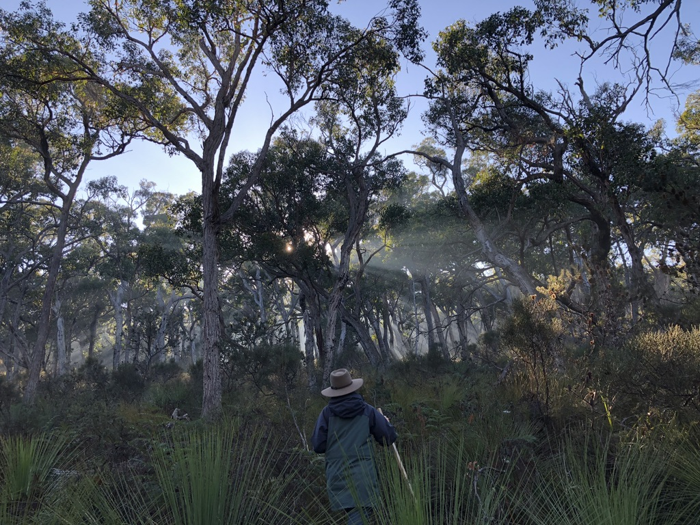

<!-- README.md is generated from README.Rmd. Please edit that file -->

```{r, echo = FALSE}
knitr::opts_chunk$set(
  collapse = TRUE,
  comment = "#>")
```

## Overview

This repository contains the data and code of my fourth PhD data chapter. 

Here, I've built generalised additive models ('GAMs'), using the ['mgcv' R-package](https://cran.r-project.org/web/packages/mgcv/mgcv.pdf), of invasive predator spatiotemporal activity in south-west Victoria, Australia. 

This paper is somewhat split between an exploratory analysis of the different ways GAMs can be used to jointly model spatial and diel activity, and aiming to provide inference on the drivers of invasive predator spatiotemporal activity in temperate, heterogeneous landscapes. Particularly whether a subordinate mesopredator (feral cat *Felis catus*) exhibits (signs of) behavioural avoidance of an apex predator (Red fox *Vulpes vulpes*). 

There are four main model types, differing in how the hourly smooth was specified:

1. Predator activity across space (tensor product of hour and coordinates)
2. Predator activity across vegetation types (hierarchical model of hour x vegetation type)
3. Feral cat activity potential avoidance of foxes (tensor product of hour and coordinates)
4. Variation in diel activity of feral cats (hierarchical model of hour x individual ID)


## Acknowledgements

The idea to use GAMs for this chapter came from Prof. Nick Golding - Nick also wrote me some initial simulation code and helped me get started with GAMs. I also learnt most of these methods and gained inspiration from [online course materials](https://noamross.github.io/mgcv-esa-2018/) and [this paper on heirarchical GAMs](https://peerj.com/articles/6876/) from Noam Ross, Gavin Simpson, David Miller and Eric Pedersen.

I compiled camera-trap data from three distinct studies:

- My PhD surveys 2017 - 2019. 

Funding and support for these surveys came from the Conservation Ecology Centre, the Victorian  Government Department of Environment, Land, Water, and Planning, Parks Victoria, Arthur Rylah  Institute for Environmental Research, Parks Victoria. 

- Glenelg Ark monitoring data 2013 - 2019. 

Robley, A., Moloney, P., Stringer, L. and Donald, S. (2020). Glenelg Ark 2005–2019: long-term predator and native mammal response to predator control. Arthur Rylah Institute for Environmental Research Technical Report Series No. 318. Department of Environment, Land, Water and Planning, Heidelberg, Victoria.

- Otway Ark monitoring data 2016 - 2018. 

Robley, A., Fanson, B. and Parks Victoria West Coast District Team. (2019). The Otway Ark: response of predators and native species 2016–2018. Arthur Rylah Institute for Environmental Research Technical Report Series No. 299. Department of Environment, Land, Water and Planning, Heidelberg, Victoria.

**Surveys were carried out the traditional lands of the Gunditjmara, Gadubanud, Kirrae Wurrung,  Gulidjan and Wadawurrung.**


```{r photo, echo = FALSE}

```

## Repository structure

**Raw data is contained in the "raw_data/" folder**.

- *"predator_records.csv"* has a row for every cat and fox camera-trap detection (no time separation between consecutive detections). 
- *"camdata.csv"* contains camera-trap deployment information and explanatory variables. Note that there are plenty of camera-traps which were deployed but did not detect predators - predator_records and camdata need to be merged to account for absences. 
- *"cat_id_detections.csv"* has a row for every cat detection for surveys in which cats were individually identified (also includes unmarked and unidentifiable cats). This is a subset of the data used in the other models, and a subset of the data used in another PhD chapter:  https://github.com/matt-w-rees/invasive-mesopredator-release (minus the Lower Glenelg National Park cats - I didn't have the detection times for these cats on-hand). 

**R scripts are contained in the "r_scripts/" folder**.

- script and function to fit lorelograms using adapted code from [Iannarilli et al. 2019](https://doi.org/10.1111/2041-210X.13308) are contained in the *"/lorelograms"* folder. This was an exploratory analysis to choose the best time-to-indepence for consecutive detections of species on each camera-trap (I chose 30 mins). This involves creating a minute by minute detection history so is computationally intensive.
- *"format_records_hour_gams.R"* reformats the raw data files into a usable dataframe for spatiotemporal GAMs. This accounts for solar times using [average double anchorage methods](https://doi.org/10.1111/2041-210X.13290), removes non-indepedent detections (within 30 mins) and reshapes into a dataframe where, for each camera-trap, there are 0 - 23 rows for hour of the day, a column for cat and fox filled with the number of 'independent' detections in each hour, as well as columns for deployment information and explanatory variables. This dataframe is saved at **"derived_data/predator_counts_hour.csv"**. 
- *"models.R"* uses mgcv to fit GAMs
- scripts beginning with *"plot_"* contain code used to create the figures with ggplot. These scripts require the *"models"* script to be run first in the same session. 
- *"individual_cats_reformat_model_plots.R"* reformats "cat_id_detections.csv" into a dataframe, runs heirarchical GAMs for each cat / cat category, and creates the figures (yeah this was a bit of an afterthought). 

**Figures for the manuscript are contained in the "figs/" folder**.

## GIFs of Invasive predator spatiotemporal activity:

#### Glenelg region

```{r glenelg, echo = FALSE}
knitr::include_graphics("figs/glenelg_predator_activity.gif")
```

#### Otway Ranges

```{r otways, echo = FALSE}
knitr::include_graphics("figs/otways_predator_activity.gif")
```

