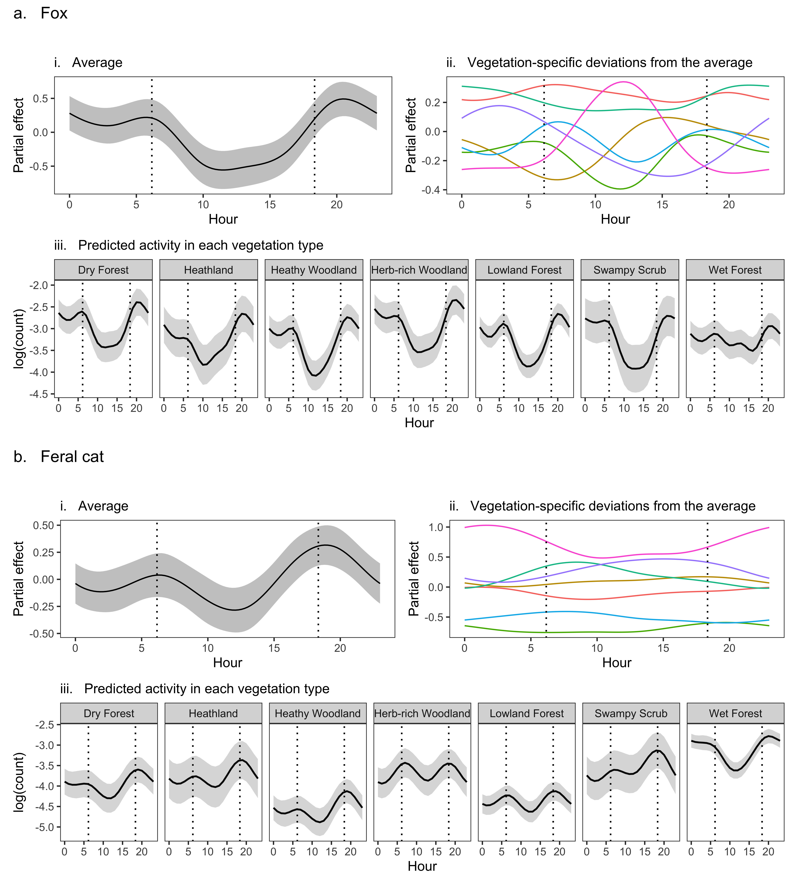
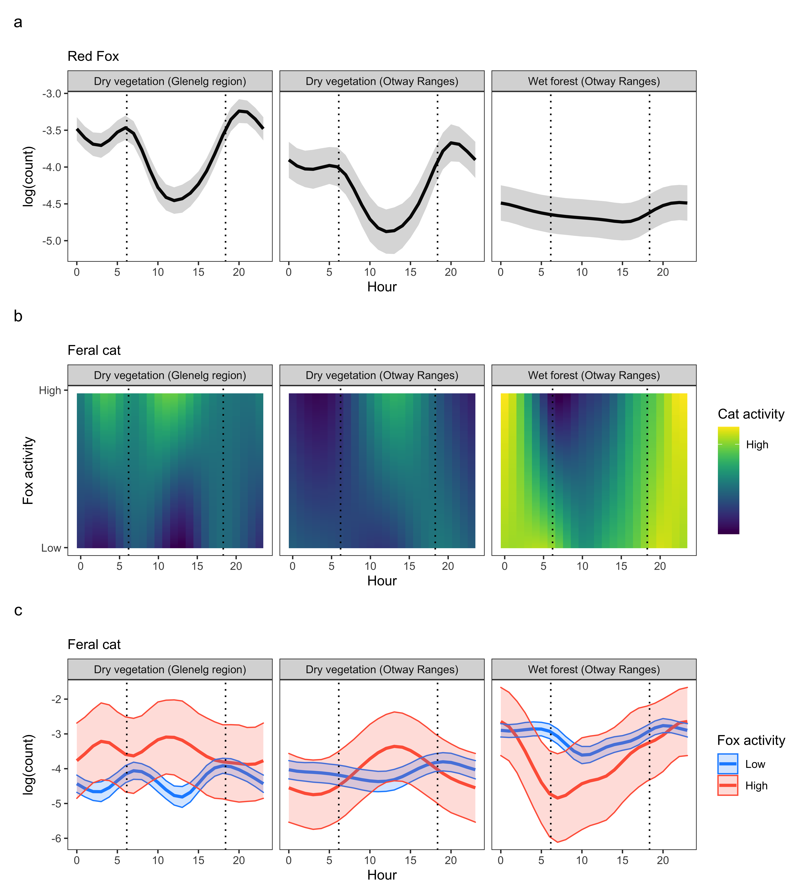

\parskip=12pt 


\newpage


```{r setup, include = FALSE}

knitr::opts_chunk$set(echo = FALSE, cache = FALSE, warning = FALSE, message = FALSE)

```

INTRODUCTION
==========================

Effective wildlife management relies on understanding species population and behavioural dynamics to accurately predict intervention outcomes. These dynamics depend on both environmental conditions and those of other species, but few statistical approaches incorporate both factors, or allow responses to be dynamic across space and time. This is key because species interactions and niche preferences are multidimensional.

Fear is a near universal driver of animal behaviour. Fear may be from other individuals of their species, a dominant species (including humans) or an event (e.g. fire). Animals may be naive to threats (e.g. alien predators), unable to respond to threats (e.g. scarce prey), or the threat may be too minimal to warrant a response. Some environments more easily facilitate avoidance (e.g. high food and shelter accessibility), and so accounting for landscape context is key. A threat response may be routine, or only employed or enhanced when the threat is heightened. This likely depends on how constant and predictable the threat is.

Animals may respond to threats by altering their activity patterns (i.e. avoidance). An animal may avoid locations where the threat is likely to occur (hereafter ‘spatial avoidance’), avoid times of the day when a threat is likely to occur (hereafter ‘temporal avoidance’), or avoid both locations and times a threat is heightened (hereafter ‘spatiotemporal avoidance’). Such avoidance likely has trade-offs, which may or may not incur costs to individual and population fitness. Modelling approaches which do not allow spatiotemporal and dynamic fear reponses can only make limited inference about species interactions. 

Species interactions are usually considered in degrees of overlap between activity patterns. Spatiotemporal avoidance is most often considered, using joint species distribution models (including MSOMs). However, temporal avoidance is increasingly being used (perhaps just allowed due to widely available GPS and camera technology) with kernel density estimation methods. Although, these methods don’t allow environmental covariates, and are particularly susceptible to noisy estimates. Importantly, some are beginning to combine these methods to allow spatiotemporal responses (Azzou et al 2021; Farris et al 2020). However, degrees of overlap in activity patterns only get at routine avoidance, we are generally interested in whether changes in threat levels lead to altered behaviour. This is more indicative of species interactions because static levels of overlap may just reflect different niche preferences rather than avoidance. 

Dynamic behavioural responses are also important from a management perspective because they want to know whether an action will cause a change in animal behaviour /  range?). For example, after the reintroduction of wolves in Yellowstone, it was widely thought that this had limited elk populations. Using GPS data and habitat selection methods,  Kohl et al. 2018 found that elk used riskier parts of landscape at times when wolves were least active -- suggesting coexistence without fitness costs. However, there are many other large carnivores in this ecosystem which are likely to impact elk behaviour. And so, will elk respond to wolves in the same way in different environmental contexts? There are little-no examples of replicated spatiotemporal interactions studies. 

There is contention around the interactions between two invasive predators - feral cats and foxes. Foxes are routinely culled, and there is concern that this could lead to a mesopredator release of feral cats. Mesopredator release may manifest in both behavioural and numerical changes, which my previous chapter identified - but that behavioral responses (ranging and detectability) were not universal. Here, we aim to dig into the behavioral response further - in particular diel activity times. 

In this study, we used generalised additive models to assess (1) how predator (fox and cat) diel activity varies between vegetation types, and (2) whether an introduced mesopredator (cat) changes its diel and/or spatial activity in response to the activity of an introduced apex predator (fox). Because foxes and cats fill a similar function niche, we expected that, on average, they would have similar diel activity patterns across vegetation types (hypothesis 1). However, where fox detections were high, we hypothesised that the subordinate cat to be less active (hypothesis 2) and shift diel activity to times when foxes are least active (hypothesis 3). We tested this on a simple predator system where only cats and foxes occur, and fox activity is manipulated through lethal control. This allowed focus on the sole interactions between these two predators, and ensured differences in correlations wasn’t just due to differences in niche preferences. 


\newpage

MATERIALS AND METHODS
==========================

## Study area

We collated camera-trap data on these two predator species from three distinct studies across two regions of south-west Victoria, Australia (Fig. 1). The purpose of each study was to experimentally survey changes in the mammalian community due to fox control, and so our dataset covered a wide range contexts with and without fox-baiting, allowing us to investigate fox-cat interactions across a gradient of apex predator (fox) activity. 

The terrestrial mammalian predator guild is depauperate throughout both regions. Dingoes *Canis familiaris* are now absent throughout, as is the the tiger quoll *Dasyurus maculatus*, more recently absent in the Otway Ranges (last sighted in 2014 despite extensive camera-trapping). Introduced red foxes and feral cats are therefore the only medium-large functional mammalian terrestrial predators across both regions. 

In the baited parts of the regions, government land managers conduct ongoing targeted fox control for biodiversity conservation. Poison baits containing 3 mg of sodium mono-fluroacetate (1080) are buried at a depth of 10 cm at 1-km intervals along accessible forest tracks and roads. 

In the Glenelg region, Gunditjmara country, natural vegetation is highly fragmented. Here, camera-survey sites were situated in six distinct forest blocks: two are separated by a river, the others are separated by at least *XX* km of pastoral farming and residential property. Foxes in three of the forest blocks have been subject to lethal control since October 2005, with 1080 poison-baits replaced fortnightly [@ROBLEY2014262]. 

The Otway Ranges, Gadubanud country, is a largely continuous patch of natural vegetation with a strong east-west rainfall and elevation gradient [@swan2021species]. Foxes are controlled through 1080 poison-baits with monthly replacement across most of the Otway Ranges, but a large section to the north-west remains unbaited. The majority of this baiting began in 2016 - 2017, although fox-baiting commenced in some small sections in 2008. 

Alongside fragmentation, the extremely rugged, wet forest and rainforest matrix in the western Otway Ranges is the main difference between the two regions. Prescribed fire, primarily for the purpose of asset protection, is another key management action undertaken throughout both regions (except in very wet sections of Otway Ranges). 

 
## Camera-trap surveys

We compiled camera-trap data from three distinct studies across the two regions. After removing camera-traps which were operational for less than 14 days, this totalled 3659 deployments of camera-traps at 1232 camera-trap sites. Survey durations ranged between 14 and 93 days (mean 47), totalling 171,966 trapnights. Camera-trap spacing was variable; the average minimum distance between simultaneously deployed camera-traps was 445, 853 and 1266 metres for each study. Camera-trap were deployed in the Glenelg region between 2013 – 2019, whereas in the Otway Ranges surveys were conducted in 2016 – 2019. 

All camera-trap deployments consisted of a Reconyx (Holmen, Wisconsin) brand camera-trap (both white and infrared flashes), attached to a tree or a metal picket, facing a lure. Camera-traps were set-up in two ways depending on the key aim of the project, either targeted toward predators or prey species. One study across both regions positioned camera-traps lower on a tree (around 15 - 30 cm above the ground – angled only slightly downwards) facing a tuna oil lure approximately 2 - 2.5 m away [detailed in @REES2019108287]. The remaining camera-traps were positioned higher on a tree or a metal picket (at least 40 cm above ground) and angled downwards more strongly - facing a lure approximately 1 - 1.5 m away. These lures consisted of peanut butter, golden syrup and rolled oats mixed into a small ball, placed within a tea strainer or PVC pipe container and secured either to the ground, or 20 - 60 cm above ground on a wooden stake. All set-ups were effective in detecting both predator species.  

## Data preparation
We first created a table of species detections and deployment information (coordinates, dates) for every camera-trap deployment.  All data analysis was conducted in R version 3.6.3 [@R]. We used lorelograms to identify the minimum interval to approximate independence [@https://doi.org/10.1111/2041-210X.13308]; this indicated 30 minutes discarding repeat detections of a species within 30 minutes was sufficient in reducing temporal autocorrelation. To account for day length variation across space and time, we extracted sunrise and sunset times for each camera-trap deployment using the 'maptools' R-package [@maptools] and adjusted detection times to be relative to sunrise and sunset using the average double anchoring approach described by @https://doi.org/10.1111/2041-210X.13290.

Using the 'reshape' R-package [@reshape], we manipulated the detection table into a dataframe with a row for each hour of the day, for every camera-trap deployment, recording the total number of 'independent' fox and feral cat detections within each hour for the entire camera-trap survey duration.  

We identified the broad vegetation type (Ecological Vegetation Class (hereafter 'EVC') group [@delwp2020]) at each camera-trap location. Six vegetation types were surveyed in both regions, although to varying degrees (Table 1). In the Otway region, rainforests are interspersed (primarily in low lying gullies) throughout wet and damp forests at a finescale, and we merged these groups (hereafter 'wet forests'). 

For each deployment, we calculated the number of poison fox-baits within a 2.3 km radius around each camera-trap - the average maximum distance foxes in these regions travel from their home range centre [@hradsky2017human].

## Generalised additive models 
We modelled predator counts (response variable) with generalised additive mixed-effects models (hereafter 'GAMMs') implemented in the 'mgcv' R-package [@wood2017]. We first fit these models using the poisson family, but switched to the negative binomial family as overdispersion, but not zero-inflation, was detected using the 'DHARMa' R-package [@DHARMa]. We specified a model offset to account for differences in camera-trap survey duration, and a random intercept for each site to account for repeat sampling. We used a duchon spline static spatial smooth to model both spatial autocorrelation and differences in predator activity across space (i.e. the effect of unmodelled environmental covariates). For the fox model, we additionally included a thin plate regression spline for poison-bait density, with a factor smoother for each region, as bait replacement schedules differed between the regions. This formed the base model specification for each model we fitted. Models (n = 2) differed in their specification of the cyclical hour smooth in order to explore (1) variations in predator diel activity across EVC groups, as well as (2) whether feral cat diel activity changed across the gradient of observed fox counts (detailed in the sections below). We used the double penalty model selection approach, which penalises the null space in addition to the range space (i.e. shrinking wiggly terms to linear terms) of the spline basis, meaning covariate effects can be entirely removed from the model [@MARRA20112372]. We plotted models using 'ggplot2' and 'gratia' R-packages [@ggplot2; @gratia]. 

We expected the activity of each predator species to follow a broadly consistent pattern (e.g. lower during the day), but potentially have small shifts in relative activity between sunset and sunrise across the different EVC groups (1). Fitting separate responses for each EVC group would throw away shared information, which is particularly costly for the least surveyed groups, and would result in more noisy estimates. We therefore specified a global smoother for hour (i.e. average response), along with group-level smoothers with shared wiggliness for each EVC group [i.e. model GS in @pedersen2019hierarchical]. This model structure penalises functions which deviate strongly from the average response, increasing confidence that they are true deviations opposed to the result of sampling noise. 

To investigate changes in feral cat  diel activity in response to counts of foxes. We added an extra column to our dataframe with the number of fox detections divided by the log of the number of survey days to account for differences in camera-trap survey durations (hereafter 'adjusted fox counts'). 

Analysis of stage 1 showed that fox diel activity patterns in wet forests differed relative to all other EVC groups. We therefore expected feral cats might to temporally avoid foxes in a different way in wet forests than the dry vegetation groups, but that responses would be similar in all the drier vegetation groups. We therefore modelled fox-induced changes in feral cat diel activity separately for wet and dry vegetation groups. We further split dry vegetation groups by region, to examine whether patterns remained consistent across space? for spatial replication. We refer to the resulting variable as 'habitat type', which had three levels: wet forests of the Otway Ranges ('wet_otways') dry EVC groups of the Otway Ranges ('dry_otways') and all of the Glenelg region data ('dry_glenelg'). 

We used a tensor product of hour (using cyclic cubic regression spline) and log adjusted fox count (using thin plate regression spline) smooths to model feral cat diel activity across the range of observed fox activity, separately for each habitat type. By also having double penalty shrinkage turned on, this meant that feral cat activity could vary nonlinearly and be penalised consistently across both dimensions. This model specification allows five different scenarios: that there was (1) no effect of hour or foxes on feral cats (2) a static hourly effect only, (3) a spatial response to foxes only, (4) a spatial response to foxes and an unrelated static hourly effect, (5) a spatial response to foxes and a hourly effect which changes across the range of fox counts. 


\newpage

```{r map, out.width="100%", fig.cap = "Locations of study sites in south-west Victoria, Australia. The grids of camera-traps are denoted by white dots. The Glenelg region is to the west and Otway region to the east. Native vegetation is indicated by dark green, with hill shading. Map tiles by Stamen Design, under CC BY 3.0, map data by OpenStreetMap, under CC BY SA."}
knitr::include_graphics("../figs/fig1_map.png")
```

\newpage

RESULTS
============

## Predator diel activity across vegetation types 

On average, both predator species occupied similar times of the day--mostly nocturnal with activity peaks around sunrise and sunset. The main difference was that fox activity peaked just after sunset rather than on sunset. For foxes, this diel pattern was largely exhibited across all vegetation types except wet forest. In wet forests and rainforests, the hour of the day had little effect on foxes (especially considering diel activity curve here is being drawn towards a nocturnal pattern). 


lowest activity during the middle of the day, peaking at sunrise and sunset times, while remaining relatively high at night and dawn. 
Foxes had a stronger diel activity patterns than cats, much less likely to be out during the day. 


Diel activity patterns were similar across the different vegetation types for each predator,, except for wet forests, where more substantial changes were seen. In the wet forests, ox activity remained fairly constant throughout day and night barely had any diel activity pattern here, cats more nocturnal.
Deviance explained and Rsq values for the two models were XX. 


## Fox-induced changes in feral cat diel activity 

We saw evidence of changes in cat diel activity due to fox activity in all three habitat types. Similar responses in dry habitats of both regions -- cat spatial activity increased with fox spatial activity, but became more diurnal. 
In Otway wet forests, no real change in spatial activity of cats due to foxes, but cats became more strongly nocturnal.  
Deviance explained and Rsq value was XX.
Slightly higher uncertainty where fox spatial activity is high, this is because we had a largest sample size for fox absences, and fewest at the extreme of fox activity. 


\newpage

```{r tab1}
library(pander)
library(tidyverse)

# load records
records <- read_csv("../derived_data/counts_hour_cleaned.csv")
# drop hour
records <- distinct(records, station_year, .keep_all = TRUE)
# get unique sites dataframe
camdata <- distinct(records, station, .keep_all = TRUE)

table1 <- records %>%
  group_by(region, vegetation_group) %>%
  mutate(sites = length(unique(station)),
         deployments = length(unique(station_year)),
         fox_count_vr = sum(fox_count),
         cat_count_vr = sum(cat_count),
         fox_present = sum(fox_pa == "present"),
         cat_present = sum(cat_pa == "present")
         )

table1 <- table1 %>%
  select(region, vegetation_group, sites, deployments, fox_count_vr, cat_count_vr)  %>% 
  distinct() %>%
  arrange(vegetation_group, region)

# rename region 
table1$region <- factor(table1$region)
levels(table1$region) <- c("Glenelg", "Otway")

# make table
pander(table1, style = "simple", split.table = Inf, caption = "Summary of camera-trap deployments in unique sites within Ecological Vegetation Class groups and independent counts of predator detections across two broad regions in south-west Victoria, Australia.", round = 2,
              col.names = c("Region", "Vegetation", "Sites", "Deployments",  "Fox counts", "Cat counts"),
)

```

\newpage

```{r veg, out.width="100%", fig.cap = "Fox (A) and feral cat (B) diel activity patterns across Ecological Vegetation Class groups in south-west Victoria, Australia. Dotted, vertical lines represent average sunrise and sunset times. Shaded areas indicate 95\\% confidence intervals."}

```


\newpage

```{r count, out.width="100%", fig.cap="Predicted feral cat diel activity (A) and uncertainty (B) across each habitat type in response to foxes (log counts adjusted for survey effort). Grey vertical lines respresent average sunrise and sunset times. Shaded areas indicate 95\\% confidence intervals."}

```

\newpage


DISCUSSION
===================

Foxes likely impacted the spatiotemporal behaviour of feral cats. One of the few studies to actually demonstrate and replicate this across ecosystems. 
Happens in different ways - context key. Spatial only, as well as temporal only models would have had opposite inference - high overlap. Joint spatiotemporal analysis is key to understand predator interactions.  

Our approach is simple and flexible. 
Small sample sizes are usually a problem. We demonstrate hierarchical model specification to share information - ability to pool all available data. 
Our approach is more aligned with null hypothesis testing - small sample sizes shrink to a flat line (or to the average), in contrast to circular overlap. 
Could be easily adapted to other contexts. E.g. instead of vegetation type, could do individual variation in diel activity.  

Combined spatiotemporal modelling - differences to other approaches. 
Cunningham paper most similar to our approach - different in diel activity only, and linear responses.
We used a tensor product for fox counts because predator interactions may not be linear [@https://doi.org/10.1111/j.1365-2664.2009.01650.x].

Limitations of our approach. 
Detectability ignored. 
Individual heterogeneity ignored.
Correlation does not = causation. 
Does not (clearly) seperate numerical responses from behavioural (Borchers SCR paper)

Invasive predators are useful species to test this on, as they are extremely adaptable to different conditions.
Implications for prey. 

Conclusions. 


\newpage

ACKNOWLEDGEMENTS
===================
We acknowledge and pay respect to the Gadubanud and Gunditjmara people on whose traditional lands this study took place. This experiment was a collaborative effort between the Glenelg Ark (Department of Environment, Land Water and Planning) and Otway Ark (Parks Victoria) working groups. We are extremely thankful to those who led and assisted with these camera-trap deployments and image processing. University of Melbourne led surveys were conducted under University of Melbourne Animal Ethics Committee approval 1714119 and Victorian Government Department of Environment, Land Water and Planning Research Permit 10008273. Our study was generously supported by the Conservation Ecology Centre, the Victorian Government Department of Environment, Land Water and Planning, Arthur Rylah Institute for Environmental Research, Parks Victoria and the Australian Government’s National Environmental Science Program through the Threatened Species Recovery Hub, and ARC Linkage Project LP170101134. MR also receives support from an Australian Government Research Training Program Scholarship.


OPEN RESEARCH
===================

Raw data and code are on Github link xx.  
Data will be deposited on the Dryad Digital Repository after acceptance.

\newpage

REFERENCES {#references .unnumbered}
==========

