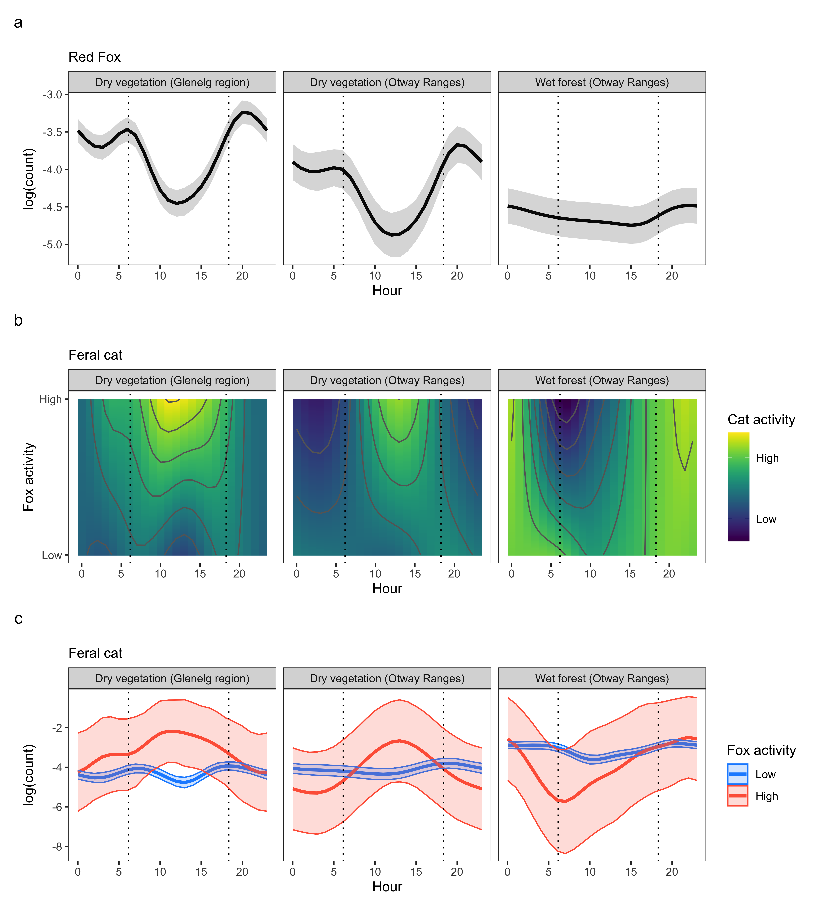

\parskip=12pt 


\newpage


```{r setup, include = FALSE}

knitr::opts_chunk$set(echo = FALSE, cache = FALSE, warning = FALSE, message = FALSE)

```

INTRODUCTION
==========================

Fear of another species is a powerful driver of animal behaviour, but difficult to measure.
Both threats and animal responses to perceived threats are dynamic - varying across space and time. 

Avoidance behaviour depends on need (how much of a threat is this?) and ability (how much is avoidance going to cost me?)
For example, avoidance behaviours are less tenable in resource poor environments. Some environment more easily facilitate avoidance (e.g. shelter availability). 
Landscape context is therefore key. 

Subordinate animals may avoid dominant ones by altering what time of day they are active, which places they are active at, or which which places they are active at during certain times of the day. 
Space use well studied, time not so much. Space and time - extremely rarely. 

Methods to monitor spatial interactions. 
Simple correlations to JSDMs. 

Methods to monitor temporal interactions. 
Coefficient of overlap -- arbitrary, don't allow covariates, highly susceptible to noise from small sample sizes.

(Lack of) methods to monitor spatio-temporal behaviour. 
GAMs increasingly used for both spatial and diel activity, but not for both (despite easily facilitating this).

Species interactions are important to understand for management. 
Particularly invasive predators. 
Cat-fox context. 

In this study, we used GAMs to (1) assess how predators change diel activity across vegetation types, and (2) changes in both diel and spatial activity of a mesopredator in response to an apex predator. Used a simple predator system, as well as manipulated apex predator activity through lethal control. 


\newpage

MATERIALS AND METHODS
==========================

## Study area

We collated camera-trap data from two distinct regions in south-west Victoria, Australia (Fig. 1). The terrestrial mammalian predator guild is depauperate here. Dingoes *Canis familiaris* are now absent throughout, as is the the tiger quoll *Dasyurus maculatus*, more recently absent in the Otway Ranges (last sighted in 2014 despite extensive camera-trapping). Introduced red foxes and feral cat are therefore the only medium-large functional mammalian terrestrial predators across both regions. Across broad sections of each region, government land managers conduct ongoing targeted fox control for biodiversity conservation - poison baits containing 3 mg of sodium mono-fluroacetate (1080) are buried at a depth of 10 cm at 1-km intervals along accessible forest tracks and roads. The purpose of each  collated camera-trap study was to to experimentally survey changes in the mammalian community due to fox control, and so, our study covers a wide range contexts with and without fox-baiting. 

In the Glenelg region, Gunditjmara country, natural vegetation has been highly fragmented. Here, camera-survey sites were situated in six distinct forest blocks; two of which separated by a river, others separated by mostly pastoral farming and residential property). Foxes in three forests blocks have been subject to lethal control since October 2005, with 1080 poison-baits replaced fortnightly [@ROBLEY2014262]. 

The Otway Ranges, Gadubanud and XX country, is a largely continuous patch of natural vegetation with a strong east-west rainfall and elevation gradient [@swan2021species]. Foxes are controlled through 1080 poison-baits with monthly replacement across most of the Otway Ranges (a large section to the north-west remains unbaited). The majority of this baiting began in 2016 - 2017, although fox-baiting commenced in some small sections in 2008. 

Alongside fragmentation, the extremely rugged, wet forest and rainforest matrix in the western Otway Ranges is the main difference between the two regions. Prescribed fire, primarily for the purpose of asset protection, is another key management action undertaken throughout both regions (except in very wet sections of Otway Ranges). 

 
## Camera-trapping surveys

We compiled camera-trap data from three distinct studies across the two regions. After removing camera-traps which were operational for less than 14 days, this totalled 3659 deployments of camera-traps at 1232 camera-trap sites. Survey durations ranged between 14 and 93 days (mean 47), totalling 171,966 trapnights. Camera-trap spacing was variable; the average minimum distance between simultaneously deployed camera-traps was 445, 853 and 1266 metres for each study. Camera-trap were deployed in the Glenelg region between 2013 – 2019, whereas in the Otway Ranges surveys were conducted in 2016 – 2019. 

All camera-trap deployments consisted of a Reconyx (Holmen, Wisconsin) brand camera-trap (both white and infrared flashes), attached to a tree or a metal picket, facing a lure. Camera-traps were set-up in two ways depending on the key aim of the project, either targeted toward predators or prey species. One study across both regions positioned camera-traps lower on a tree (around 15 - 30 cm above the ground – angled only slightly downwards) facing a tuna oil lure approximately 2 - 2.5 m away [detailed in @REES2019108287]. The remaining camera-traps were positioned higher on a tree or a metal picket (at least 40 cm above ground) and angled downwards more strongly - facing a lure approximately 1 - 1.5 m away. These lures consisted of peanut butter, golden syrup and rolled oats were mixed into a small ball, placed within a tea strainer or PVC pipe container and secured either to the ground, or 20 - 60 cm above ground on a wooden stake. All set-ups were effective in detecting both predator and prey species.  

## Data preparation
We first created a table of species detections and deployment information (coordinates, dates) for every camera-trap deployment in R version 3.6.3 [@R].
We used lorelograms to identify the minimum interval to approximate independence [@https://doi.org/10.1111/2041-210X.13308]; discarding repeat detections of a species within 30 minutes to reduce temporal autocorrelation. To account for day length variation across space and time, we extracted sunrise and sunset times for each camera-trap deployment using the 'maptools' R-package [@maptools] and adjusted detection times to be relative to sunrise and sunset using the average double anchoring approach described by @https://doi.org/10.1111/2041-210X.13290.

We attached Ecological Vegetation Class (hereafter 'EVC') groups [@delwp2020] to each camera-trap location. Rainforests are interspersed (primarily in low lying gullies) throughout wet and damp forests at a finescale (relevant to predator movements), and so, we merged these groupings (hereafter 'wet forests'). For each deployment, we calculated the number of poison fox-baits within a 2.3 km radius around each camera-trap - the average maximum distance foxes in these region travel from their home range centre [@hradsky2017human].

Using the 'reshape' R-package [@reshape], we manipulated the detection table into a dataframe with a row for each hour of the day, for every camera-trap deployment, recording the total number of 'independent' fox and feral cat detections within each hour for the entire camera-trap survey duration.  

## Generalised additive models of diel activity 
We modelled predator counts (response variable) with generalised additive mixed-effects models (hereafter 'GAMMs') implemented in the 'mgcv' R-package [@wood2017]. We first fit these models using the poisson family, but switched to the negative binomial family as overdispersion, but not zero-inflation, was detected using the 'DHARMa' R-package [@DHARMa]. We specified a model offset to account for differences in camera-trap survey durations and a random intercept for each site to account for repeat sampling. We used a duchon spline static spatial smooth to model both spatial autocorrelation and differences in predator activity across space (i.e. the effect of unmodelled environmental covariates). For the fox model, we additionally included a thin plate regression spline for poison-bait density, with a factor smoother for each region, as bait replacement schedules differed between the regions. This formed the base model specification for each model we fitted. Models (n = 3) differed in their specification of the cyclical hour smooth in order to explore (1) variations in predator diel activity across EVC groups, as well as (2) whether feral cat diel activity changed across the gradient of observed fox counts (detailed in the sections below). We plotted models using 'ggplot2' and 'gratia' R-packages [@ggplot2; @gratia]. 

We expected predator activity to be lowest during the day, but potentially having small shifts in relative activity between sunset and sunrise across the different EVC groups (1). And so, fitting separate responses for each EVC group would throw away this shared information, which is particularly costly for the least surveyed groups -- resulting in more noisy estimates. We therefore specified a global smoother for hour (i.e. average response), along with group-level smoothers with shared wiggliness for each EVC group [i.e. model GS in @pedersen2019hierarchical]. This model structure penalises functions which deviate strongly from the average response--increasing confidence that they are true deviations opposed to the result of sampling noise. 
Because feral cats are likely subordinate to foxes, we investigated changes in their diel activity in response to counts of foxes. We added an extra column to our dataframe with the number of fox detections divided by the log of the survey days to account for differences in camera-trap survey durations (hereafter 'adjusted fox counts'). Because we saw different fox diel activity patterns in wet forests relative to the other EVC groups, we expected feral cats to temporally avoid foxes in opposing ways between these wet and dry vegetation groups. We therefore modelled fox-induced changes in feral cat diel activity separately for wet and dry vegetation groups. Because of our large sample size, we further split dry vegetation groups by region for spatial replication. We refer to this variable as 'habitat type'; having three levels: wet forests of the Otway Ranges ('wet_otways') dry EVC groups of the Otway Ranges ('dry_otways') and all of the Glenelg region data ('dry_glenelg'). We used a tensor product of hour (cyclic cubic regression spline) and log adjusted fox counts (thin plate regression spline) to model feral cat diel activity across the range of observed fox activity, separately for each habitat type. 


\newpage

```{r map, out.width="100%", fig.cap = "Locations of study sites in south-west Victoria, Australia. The grids of camera-traps are denoted by white dots. The Glenelg region is to the west and Otway region to the east. Native vegetation is indicated by dark green, with hill shading. Map tiles by Stamen Design, under CC BY 3.0, map data by OpenStreetMap, under CC BY SA."}
knitr::include_graphics("../figs/fig1_map.png")
```

\newpage

RESULTS
============

## Predator diel activity across vegetation types 

On average, both predator species occupied similar times of the day. Lowest during the day, peaking during sunset and sunrise, high at night. 
Foxes had a stronger diel activity patterns than cats, much less likely to be out during the day. 
Both predators had slight variations in diel activity across EVC groups, except for wet forests, were more substantial changes were seen. 
Foxes barely had any diel activity pattern here, cats more nocturnal.
Deviance explained and Rsq values for the two models were XX. 


## Fox-induced changes in feral cat diel activity 

We saw evidence of changes in cat diel activity due to fox activity in all three habitat types. Similar responses in dry habitats of both regions -- cat spatial activity increased with fox spatial activity, but became more diurnal. 
In Otway wet forests, no real change in spatial activity of cats due to foxes, but cats became more strongly nocturnal.  
Deviance explained and Rsq value was XX.
Slightly higher uncertainty where fox spatial activity is high, this is because we had a largest sample size for fox absences, and fewest at the extreme of fox activity. 


\newpage

```{r tab1}
library(pander)
library(tidyverse)

# load records
records <- read_csv("../derived_data/counts_hour_cleaned.csv")
# drop hour
records <- distinct(records, station_year, .keep_all = TRUE)
# get unique sites dataframe
camdata <- distinct(records, station, .keep_all = TRUE)

table1 <- records %>%
  group_by(region, vegetation_group) %>%
  mutate(sites = length(unique(station)),
         deployments = length(unique(station_year)),
         fox_count_vr = sum(fox_count),
         cat_count_vr = sum(cat_count),
         fox_present = sum(fox_pa == "present"),
         cat_present = sum(cat_pa == "present")
         )

table1 <- table1 %>%
  select(region, vegetation_group, sites, deployments, fox_count_vr, cat_count_vr)  %>% 
  distinct() %>%
  arrange(vegetation_group, region)

# rename region 
table1$region <- factor(table1$region)
levels(table1$region) <- c("Glenelg", "Otway")

# make table
pander(table1, style = "simple", split.table = Inf, caption = "Summary of camera-trap deployments in unique sites within Ecological Vegetation Class groups, as well as independent counts of predator detections and naive occupancy rates, across two broad regions in south-west Victoria, Australia.", round = 2,
              col.names = c("Region", "Vegetation", "Sites", "Deployments",  "Fox counts", "Cat counts"),
)


```

\newpage

```{r veg, out.width="100%", fig.cap = "Fox (A) and feral cat (B) diel activity patterns across Ecological Vegetation Class groups in south-west Victoria, Australia. Dotted, vertical lines respresent average sunrise and sunset times. Shaded areas indicate 95\\% confidence intervals."}
knitr::include_graphics("../figs/predator_veg.png")
```


\newpage

```{r count, out.width="100%", fig.cap="Predicted feral cat diel activity (A) and uncertainty (B) across each habitat type in response to foxes (log counts adjusted for survey effort). Grey vertical lines respresent average sunrise and sunset times. Shaded areas indicate 95\\% confidence intervals."}

```

\newpage


DISCUSSION
===================

Foxes likely impacted the spatiotemporal behaviour of feral cats. One of the few studies to actually demonstrate and replicate this across ecosystems. 
Happens in different ways - context key. Spatial only, as well as temporal only models would have had opposite inference - high overlap. Joint spatiotemporal analysis is key to understand predator interactions.  

Our approach is simple and flexible. 
Small sample sizes are usually a problem. We demonstrate hierarchical model specification to share information - ability to pool all available data. 
Our approach is more aligned with null hypothesis testing - small sample sizes shrink to a flat line (or to the average), in contrast to circular overlap. 
Could be easily adapted to other contexts. E.g. instead of vegetation type, could do individual variation in diel activity.  

Combined spatiotemporal modelling - differences to other approaches. 
Cunningham paper most similar to our approach - different in diel activity only, and linear responses.
We used a tensor product for fox counts because predator interactions may not be linear [@https://doi.org/10.1111/j.1365-2664.2009.01650.x].

Limitations of our approach. 
Detectability ignored. 
Individual heterogeneity ignored.
Correlation does not = causation. 
Does not (clearly) seperate numerical responses from behavioural (Borchers SCR paper)

Invasive predators are useful species to test this on, as they are extremely adaptable to different conditions.
Implications for prey. 

Conclusions. 


\newpage

ACKNOWLEDGEMENTS
===================
We acknowledge and pay respect to the Gadubanud and Gunditjmara people on whose traditional lands this study took place. This experiment was a collaborative effort between the Glenelg Ark (Department of Environment, Land Water and Planning) and Otway Ark (Parks Victoria) working groups. We are extremely thankful to those who led and assisted with these camera-trap deployments and image processing. University of Melbourne led surveys were conducted under University of Melbourne Animal Ethics Committee approval 1714119 and Victorian Government Department of Environment, Land Water and Planning Research Permit 10008273. Our study was generously supported by the Conservation Ecology Centre, the Victorian Government Department of Environment, Land Water and Planning, Arthur Rylah Institute for Environmental Research, Parks Victoria and the Australian Government’s National Environmental Science Program through the Threatened Species Recovery Hub, and ARC Linkage Project LP170101134. MR also receives support from an Australian Government Research Training Program Scholarship.


OPEN RESEARCH
===================

Raw data and code are on Github link xx.  
Data will be deposited on the Dryad Digital Repository after acceptance.

\newpage

REFERENCES {#references .unnumbered}
==========

