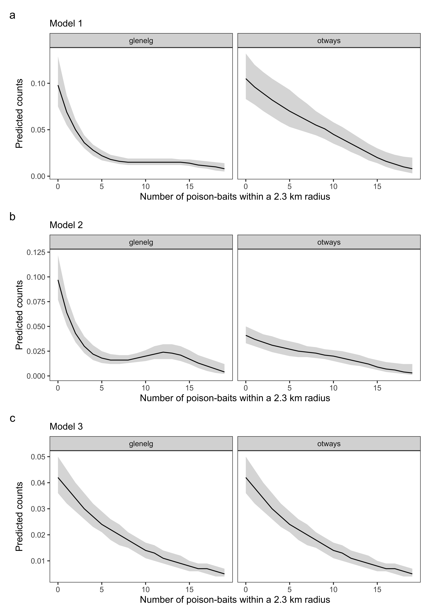

```{r setup, include = FALSE}
knitr::opts_chunk$set(
  echo      = FALSE,
  warning   = FALSE,
  message   = FALSE,
  error     = FALSE,
  cache     = FALSE,
  fig.path  = "../figs/",
  fig.align = "center",
  out.width = "80%")

library(kableExtra)
library(dplyr)
library(readr)

```


```{=tex}
\parskip=12pt 
\newpage
\setcounter{page}{1}
```

# Spatial variation in predator diel activity patterns {.unnumbered}

$~$

\linenumbers

# ABSTRACT {.unnumbered}

Understanding the constraints dominant predators impose on subordinate species is important for predicting ecosystem dynamics and anticipating outcomes of predator management. Subordinate predators may avoid dominant predators in time or space, making it difficult to quantify antipredator behaviours unless joint spatiotemporal analyses are used.
Here, we tested whether an invasive dominant predator (red fox *Vulpes vulpes*) alters the spatiotemporal activity of an invasive subordinate predator (feral cat *Felis catus*). We collated records of both species from 3,667 camera-traps deployed experimentally across two regions of south-eastern Australia with simplified predator guilds; foxes were poison-baited in some landscapes within each region. We used generalised additive models to quantify changes in predator spatiotemporal activity across geographic space, vegetation types, human footprint and (artificially manipulated) gradients of dominant predator activity.
Foxes and cats had similar diel activity patterns when averaged across all sites, however there was important differentiation at a finer scale---cats did not reduce their spatial activity but shifted diel patterns when localised fox activity was high. Cats were crepuscular on average. However, across dry vegetation types of both regions (where foxes were nocturnal), cats shifted to diurnal behaviour with increasing fox activity. In contrast, fox activity was relatively consistent throughout the daily cycle in the wet forest; here cats avoided dawn when fox activity was high. Changes in cat diel activity patterns may facilitate spatial coexistence between these two invasive predators, potentially shifting feral cat impacts onto different native prey.
It is well-appreciated that predator activity varies spatially and fluctuates throughout the daily cycle. However, our study demonstrates that diel activity patterns also vary across space, likely mediated by both landscape-context and fear. dominant predator avoidance appears to be dynamic---a key nuance which is overlooked when simply comparing the average activity overlap between two species.

\newpage

# INTRODUCTION

Top predators can drive ecosystem structure and dynamics by suppressing populations of rival predators and prey species [@estes2011trophic; @prugh2009rise]. Dominant predators can suppress subordinate species directly through antagonistic interactions and predation, as well as indirectly through fear [@creel2008relationships; @allen2022fear]. Fear-induced behavioural suppression can be as detrimental to subordinate species as predation itself, by limiting resource acquisition and breeding success [@schmitz2004trophic; @preisser2005scared; @brown1999ecology]. Understanding how top predators&mdash;including humans&mdash;constrain the behaviour of subordinate species is therefore important to accurately predict consequences of predator management, such as reintroductions or lethal control [@suraci2016fear; @gaynor2021applied].

Spatial and/or temporal niche partitioning may allow subordinate species to coexist with top predators by reducing encounter-rates and resource overlap [@kronfeld2003partitioning]. However, subordinate species may not consistently employ avoidance behaviours because perceived predation risk is spatiotemporally variable, and antipredator behaviours typically involve a trade-off against resource acquisition, such as limiting or relegating activity to suboptimal places or times [@lima1999temporal; @lima1990behavioral]. Therefore, optimal predator avoidance strategies likely vary across heterogeneous landscapes where resource availability (e.g., shelter, food) and perceived predation risks differ [@kauffman2007landscape; @willems2009predator; @wirsing2021context; @davies2021spatial]. For example, temporal predator avoidance may be preferable over spatial avoidance if food is constantly available throughout the day, and vice versa. These theories are unified under the ecology of fear concept [@brown1999ecology], which has gained increasing attention in recent times [@gaynor2019landscapes]. However, there remains a lack of robust, empirical evidence documenting dynamic changes in antipredator behaviour.

Animal diel activity patterns are increasingly being considered alongside spatial activity and distributional patterns. However, spatial and temporal (in regard to the daily cycle) activity patterns are still often considered in an ad-hoc fashion. For example, by fitting separate models for spatial and temporal overlap, or by repeating spatial analyses (e.g., resource selection functions) at different time periods such night and day [e.g., @basille2015plastic; @kohl2019prey; @smith2019integrating; @wooster2022predator]. Such ad-hoc approaches make it difficult to assess the relative importance, as well as dynamic changes in spatial and temporal processes [@suraci2022beyond].

There are many approaches to modelling intraguild spatiotemporal interactions, such as time-to-encounter models and coefficients of activity overlap [@frey2017investigating]. Time-to-encounter approaches consider fine-scale avoidance or attraction by using time intervals between species detections as the response variable, although do not estimate diel activity patterns [@harmsen2009spatial; @niedballa2019assessing; @fancourt2019introduced]. Multispecies models have been recently developed to assess overlap in spatial and diel activity between two species [@azzou2021sparse], as well as different diel activity patterns based on the presence or absence of another species at a site [@kellner2022two]. Multispecies models are data-hungry and difficult to fit, but can account for imperfect detection and different types of predictor variables [e.g., @parsons2022effect]. Given avoidance behaviours are likely dynamic [@gaynor2019landscapes], there is need for statistical approaches which jointly assess continuous shifts in spatial and diel activity patterns of one species in response to another, particularly when combined with experimental data [@suraci2022beyond].

Generalised Additive Models (hereafter 'GAMs') are increasingly being used to estimate animal diel activity patterns and offer a flexible framework to jointly consider spatial activity. GAMs are useful to model diel activity patterns as they can implement cyclical splines&mdash;joining the end with the start of the day&mdash;as well as complexity penalties to reduce overfitting. If complex nonlinear (i.e., wiggly) effects are not statistically supported, smoothing penalties in GAMs 'shrink' them to a linear (i.e., no wiggliness) effect, or even to a horizontal line - removing the entire effect of the predictor variable and therefore  the need for additional tests of statistical significance (such as p-values and information criteria). GAMS can also capture nonlinear interactions between multiple variables with different units (i.e., 'tensor products'), and offer the ability to share information across categorical variables through hierarchical specifications [@wood2017generalized; @pedersen2019hierarchical]. However, we are only aware of one study which allowed animal diel activity to interact with predation risk as a continuous variable in a GAM [although without considering overall activity, @cunningham2019temporal].

The red fox *Vulpes vulpes* (hereafter 'fox') and feral cat *Felis catus* (hereafter 'cat') have devastating impacts on native prey throughout their introduced range, implicated in the extinction of \~10 and 63 species, respectively [@doherty2016invasive]. The impacts of these invasive predators are particularly extreme on the Australian continent [@woinarski2015ongoing]. Cats are more difficult to manage, and so introduced predator control programs in Australia often target only foxes [particularly through poison-baiting, @reddiex2007control]. As foxes and cats compete for many of the same resources [@fleming2022distinctive], there is concern that lethal fox control could cause mesopredator release [@soule1988reconstructed] of cats [@glen2005complex; @doherty2017stop; @wayne2017recoveries]. However, there is limited evidence that spatial cat activity increases in response to fox control [@hunter2018not], although there are signs of changes in behaviour and population density [@molsher2017mesopredator; @rees2023mesopredator]. Other studies have investigated potential spatial and temporal interactions between these invasive predators [e.g., @roshier2021space], but not in response to fox control, or in a joint spatiotemporal framework that allows flexibility in cat avoidance behaviours with respect to differences in fox activity. Conservation managers are therefore uncertain as to whether fox control may increase the impacts of feral cats on native prey, through increases in cat density or behavioural changes which improve hunting success. 

In this study, we first explored (1) how predator diel activity patterns vary across geographic space ('model 1'), and (2) the role of vegetation type and human footprint in predator activity patterns ('model 2'). Using this knowledge to partition our dataset, we then (3) tested whether the activity of a dominant predator (fox) affected the spatiotemporal activity of a subordinate predator (cat; 'model 3'). In line with behavioural avoidance or exclusion, we predicted that cat diel activity pattens would shift towards less-risky times of day (i.e., times when fox activity was lower), and/or spatial cat activity would be lower at sites where fox activity was relatively high. We illustrate how GAMs can provide a simple framework to jointly assess spatial and temporal animal activity patterns, as well as potential species interactions. 


\newpage

# MATERIALS AND METHODS

## Study area and camera-trapping
Our study was conducted in a simple predator system where foxes and cats are the only medium-large (> 1 kg) mammalian predators, and fox activity is manipulated using lethal control in some landscapes. This situation allowed sole focus on the interactions between these two predators, across an experimental gradient of dominant predator (fox) activity. We compiled data from multiple smaller-scale camera-trap studies, each designed to experimentally assess mammal responses to fox control. Overall, we collated 5,449 and 2,202 independent detections of foxes and cats, respectively (separated by at least 30 minutes) from 172,052 camera-trap nights (Table \@ref(tab:diel-tab1)). 

We collated camera-trap data across two regions in south-west Victoria, Australia: the Glenelg region and Otway Ranges (Fig. \@ref(fig:diel-map)). Here, dingoes *Canis familiaris* are long-absent throughout, while tiger quolls *Dasyurus maculatus* are long-absent in the Glenelg region and likely functionally extinct in the Otway Ranges (last confirmed sighting in 2014). In broad sections of each region, government land managers conduct ongoing targeted lethal fox control for biodiversity conservation (see sections below for region-specific details). Poison-baits containing 3 mg of sodium fluroacetate (compound 1080) are buried at a depth of 12 - 15 cm at 1-km intervals along accessible forest tracks and roads. Different road densities therefore result in variable densities of poison-baits. Foxes readily dig these poison-baits often resulting in population suppression, whereas it is generally accepted that cats are unlikely to consume buried fox-baits and there is no evidence buried 1080 fox-baits suppresses cat populations [@algar2004feral; @moseby2011use; @risbey1997control; @hunter2018not]. Managers also frequently implement prescribed fire across both regions, primarily to reduce fuel loads to prevent large wildfires.


### Glenelg region
In the Glenelg region, large patches of natural vegetation are fragmented by pastoral farming and residential properties (Fig. \@ref(fig:diel-map)). Foxes in three distinct forest blocks in this region have been subject to poison-baiting since October 2005, with fortnightly bait replacements [@robley2014long]. These forest blocks, along with three similar, unbaited forest blocks to the north have been simultaneously surveyed annually under the 'Glenelg Ark' fox control program since 2005 [40 sites per block, @robley2020glenelg]. Hair-tubes were used to monitor species from 2005 - 2013 [presented in @robley2014long], replaced by camera-traps from 2013; here we present camera-trap data from 2013 - 2019 [@robley2020glenelg]. We also included a further 425 camera-trap deployments at unique locations from early 2018 [M.W.R PhD Surveys', @rees2023data]. This totals 2,039 camera-trap deployments in the Glenelg region, collected in a control-impact experimental design (foxes had been continuously controlled for at 8 - 14 years in the treatment landscapes at the time of these surveys).

### Otway Ranges
The Otway Ranges is a largely continuous patch of natural vegetation with a strong east-west rainfall gradient (Fig. \@ref(fig:diel-map)). A matrix of cool temperate rainforest and wet forest at high altitudes in the south-west descend into a large heathland directly north, and into dry forests and then heathlands to the north-east. Fox-baiting commenced in small sections of the Otway Ranges in 2008 and large-scale systematic baiting began in 2016 - 2017 under the 'Otway Ark' program [@robley2019otway]. For the first six weeks, poison-baits were replaced weekly, then changing to ongoing monthly bait-replacement. There was a pause in baiting for approximately six months during the second half of 2018. Fox control recommenced in late 2018 with four weeks of fortnightly bait-replacement, before returning to monthly bait-replacement. A large section of the Otway Ranges to the north-west remains unbaited, but is monitored as an experimental non-treatment site [@robley2019otway]. Otway Ark managers survey 372 camera-trap sites annually (sequentially across the region); we present one 'before' baiting survey and two 'after' baiting surveys of each site from 2016 - 2018, totalling 1,113 camera-trap deployments [@robley2019otway]. We also include data from an additional before-after control-impact surveys (one 'before' baiting survey and two 'after' baiting surveys) in the western section of the Otway Ranges, conducted annually 2017 - 2019 [@rees2023data]. This added a further 195 sites and 524 camera-trap deployments (Table \@ref(tab:tab-sum)).

### Camera-trap set-ups
All camera-trap deployments consisted of a Reconyx (Holmen, Wisconsin) brand camera-trap (white or infrared flash), attached to a tree or a metal picket, facing a lure. All camera-trap sites were positioned in the forest interior at least 30 m away from roads. The Glenelg Ark and Otway Ark fox monitoring programs positioned camera-traps at least 40 cm above ground on a tree or a metal picket and angled downwards toward a lure approximately 1 - 1.5 m away [@robley2020glenelg; @robley2019otway]. The lures consisted of peanut butter, golden syrup and rolled oats mixed into a small ball, placed within a tea strainer or PVC pipe container and secured either to the ground, or 20 - 60 cm above ground on a wooden stake. The M.W.R PhD surveys across both regions positioned camera-traps lower on a tree (around 15 - 30 cm above the ground) angled only slightly downwards toward a tuna oil lure approximately 2 - 2.5 m away [detailed in @rees2023mesopredator]. Camera-traps were active for an average of 47 days (maximum 93 days), totalling 172,052 trap-nights. Camera-trap spacing averaged 867 m for Glenelg Ark, 1246 m for Otway Ark, and 444 m for the M.W.R PhD surveys (Table \@ref(tab:tab-sum)).

## Data preparation
Analyses were conducted in R version 4.1.3 [@R]. We first used lorelograms to identify the minimum interval to approximate independence [@iannarilli2019lorelograms]; this indicated that discarding repeat detections of a species within 30 minutes was sufficient to reduce temporal autocorrelation. To account for day length variation across space and time, we extracted sunrise and sunset times for each camera-trap deployment using the 'maptools' R-package [@maptools] and adjusted detection times to be relative to sunrise and sunset using the average double anchoring approach described by @vazquez2019comparing. We then built a dataframe consisting of a row for each hour of the day (0 -- 23), for every camera-trap deployment (n = 3,667), recording the total number of 'independent' fox and feral cat detections within each hour across the camera-trap survey.

## Generalised additive models 
We modelled the total number of independent detections of each predator per hour for each camera-trap deployment (response variable) with generalised additive mixed-effect models implemented in the 'mgcv' R-package [@wood2017generalized]. We used the negative binomial family, as overdispersion, but not zero-inflation, was detected with a poisson distribution using the 'DHARMa' R-package [@DHARMa]. We specified the natural log of the number of survey days as a model offset to account for differences in camera-trap survey duration, and a random intercept for each site to account for repeat sampling for models 2 and 3 (as pseudoreplication from repeat sampling in model 1 was explicitly accounted for using the spatial term). For fox models, we also included a smooth effect of poison-bait density [number of baits within a 2.3 km radius around each camera-trap - the average maximum distance adult foxes travel from their home-range centre in these regions, @hradsky2017human] with separate responses per region to account for the effect of fox control. These specifications were included in each model we fitted; models differed in their specification of the cyclical hour smooth to provide inference on variations of predator diel activity across the three questions of interest - this is detailed in the sections below. We used the 'ggplot2' [@ggplot2] and 'gratia' [@gratia] R-packages to plot models.

In this paper, we use the term 'spatial activity' to refer to the number of 'independent' predator detections at a site (offset to account for survey duration; analogous to an activity or abundance index), and 'diel activity pattern' to refer to fluctuations in relative activity throughout the 24-hour daily cycle. The first two models we fit explored how predator spatiotemporal activity varied across these regions, informing the best structure for our third model which tested the activity of foxes limits the spatiotemporal activity of cats (detailed in the sections below).

### How does predator diel activity patterns vary across geographic space? (model 1)
To examine how the spatial activity and diel activity patterns of each predator varied across space, we fit a model for each predator which included a tensor product interaction between a spatial smooth (thin plate regression spline) and hourly smooth. This model specification allowed predators to have different activity levels across space (static across the years surveyed), as well as variation in diel activity pattern across space. Space was modelled using camera-trap coordinates and a duchon spline basis [@miller2014finite].

### How does vegetation type and human footprint affect predator activity patterns? (model 2)
The spatial term in model 1 estimated differences in predator activity across geographic space; we hypothesised that this was partly due to differences in vegetation type, based both on the observed spatial patterns and because vegetation type is a major driver of understorey habitat structure and prey occurrence in these regions [@swan2015predicting; @hradsky2017bayesian]. To test whether the diel activity pattern of each predator varied among vegetation types, we identified the Ecological Vegetation Class group [hereafter 'vegetation type' - standard units for vegetation classification in Victoria, @delwp2020bioregions] for each unique camera-trap site, totalling eight vegetation types. As rainforests are interspersed (primarily in low lying gullies) at fine-scales throughout wet and damp forests in the south-eastern Otway Ranges, we merged them together (hereafter referred to as 'wet forests'). We then estimated predator activity across vegetation types using a hierarchical model specification: a global smoother for hour (i.e., average response) and group-level smoothers with shared wiggliness for the seven vegetation types ['model GS' detailed in @pedersen2019hierarchical]. We also fit a tensor product interaction term for hour and the human footprint index [@venter2016sixteen; @venter2018last]; as human footprint is known to impact animal activity patterns [@gaynor2018influence; @van2023influence]

### Do feral cats avoid foxes in space or time? (model 3)
Fox diel activity across vegetation types showed strong similarity between all vegetation types except wet forests. To examine whether cats avoid foxes in space or time, we therefore modelled fox-induced changes in feral cat diel activity separately for wet forest and dry vegetation types. We further split dry vegetation types by region for further replication. We refer to the resulting variable as 'habitat type', which had three levels: (i) wet forests and rainforests in the western Otway Ranges ('wet_otways'), (ii) dry vegetation types in the Otway Ranges ('dry_otways') and (iii) dry vegetation types in the Glenelg region ('dry_glenelg'). We further hypothesised that cats would avoid foxes in time by becoming more diurnal in dry vegetation types where foxes were mostly nocturnal, but not in wet forests where fox activity showed little variation across the daily cycle.

To investigate changes in feral cat diel activity across the range of observed fox activity, we first quantified fox activity for each camera trap deployment as the total number of fox detections for the deployment divided by the number of survey days, to adjust for differences in survey duration (hereafter 'adjusted fox counts'). We modelled an interaction between hour and adjusted fox counts (as a thin plate regression spline with shrinkage - so complexity penalties could entirely remove this effect from the model if not supported), allowing cats to have nonlinear responses to both hour and adjusted fox counts. We fit separate tensor product interactions for each habitat type (using a 'by-variable' term). For a direct visual comparison to fox activity, we fit another fox model where a diel activity curve was estimated separately across each of the three habitat types.

\newpage

(ref:fig1cap) Locations of our study regions in south-west Victoria, Australia. The grids of camera-traps are denoted by white dots. The Glenelg region (38°05'54"S 141°44'41"E) is to the west and Otway Ranges (38°57'82"S 141°68'41"E) to the east. Native vegetation is indicated by dark green, with hill shading. *Map tiles by Stamen Design, under CC BY 3.0, map data by OpenStreetMap, under CC BY SA.*. 


```{r diel-map, fig.cap = '(ref:fig1cap)'}
knitr::include_graphics("../figs/map_cams.png")
```

\newpage

# RESULTS

## Lethal suppression of foxes  
In each model, there was a strong effect of poison fox-baiting on fox spatial activity, particularly in the Glenelg region (Supporting Information Fig. \@ref(fig:fox-baits)b). Predicted fox counts on the response scale were reduced by a factor of 12, 24, and 28 in the Glenelg region, as well as a factor of 13, 13, and 8 in the Otway Ranges, for models 1, 2, and 3, respectively. For example, model 2 predicted fox counts in the Glenelg region to range from 0.097 (95% CI: 0.077 - 0.122) in sites with no fox-baiting, to 0.004 (95% CI: 0.002 - 0.012) at sites with the maximum poison-bait density; in the Otways ranging from 0.041 (95% CI: 0.033 - 0.05) - 0.008 (95% CI: 0.003 - 0.020) across the gradient of poison-bait density.

## How does predator diel activity patterns vary across geographic space? (model 1)
Predator activity varied considerably across space and throughout the 24-hour daily cycle, and there was some variation in the predator diel activity patterns across space. On average, both predators showed similar diel activity patterns, with peaks in activity around sunrise and sunset (i.e., crepuscular), although were more likely to be active during the night than the day (Fig. \@ref(fig:diel-st-int)i). On average, the main difference between the species was that fox activity peaked just after sunset and they were less likely to be active during the day than cats. Cats also tended to be more active at sunset relative to sunrise (Fig. \@ref(fig:diel-st-int)i).

The interaction between hourly and spatial smooths revealed deviations from marginal diel activity pattern in space, particularly across the two regions, and within the Otway Ranges (Fig. \@ref(fig:diel-st-int)). For example, at midday, foxes were less active in the Glenelg region and more active across much of the Otway Ranges (except for the north-east) than the average diel activity pattern. Relative to foxes, cats had slightly more complex (i.e., wiggly) deviations in space from their average diel activity pattern. Most notably, cats were less active during sunset and more active at midnight in the Otway Ranges relative to the Glenelg region (Fig. \@ref(fig:diel-st-int)).

## How does vegetation type and human footprint affect predator activity patterns? (model 2)
Vegetation type had a strong influence on the spatial and diel activity patterns of foxes and cats, whereas human footprint only affected fox spatial activity. Spatial levels of fox activity were similar across all vegetation types, except wet forests where fox activity was considerably lower. Spatial cat activity was relatively more variable across vegetation types; lowest in heathy woodlands and highest in wet forests (Fig. \@ref(fig:diel-veg)b). Diel activity patterns for foxes were similar across all vegetation type except wet forests; in wet forests, foxes were consistently active throughout the daily cycle (Fig. \@ref(fig:diel-veg)a). On the other hand, cats were mostly nocturnal (and most active) in wet forests, but largely crepuscular in all other vegetation types (Fig. \@ref(fig:diel-veg)a).

There was no evidence that human footprint affected diel activity patterns for either predator species; the interaction term between hour and human footprint index was removed from both models. Fox spatial activity increased linearly with the human footprint index (Supporting Information Fig. \@ref(fig:fox-hfi)a), although human footprint did not impact cat spatial activity (the marginal effect of human footprint was also removed from the cat model). 

## Do feral cats avoid foxes in space or time? (model 3)
The model indicated that cats avoided foxes temporally rather than spatially (Fig. \@ref(fig:diel-cat-fox)). Fox activity did not impact spatial cat activity in the Otway Ranges, whereas cat spatial activity slightly increased with adjusted fox counts in the Glenelg region.

Across all habitat types, feral cat diel activity patterns changed across gradients of fox activity (Fig. \@ref(fig:diel-cat-fox)). In the Glenelg region and Otway dry habitat types, feral cats had a nocturnal-crepuscular diel activity pattern where fox activity was low, but were most active during the day where fox activity was high. In contrast, in the wet forests of the Otway Ranges, feral cats were more strongly nocturnal when fox activity was high, avoiding dawn in particular. 


\newpage

```{r diel-st-int, out.width = "70%", fig.cap = "Marginal diel activity (i) and space-time interaction effect in the Glenelg region (ii) and Otway Ranges (iii) at midnight (0), sunrise (6), midday (12) and sunset (18) times for introduced red foxes \\textit{Vulpes vulpes} and feral cats \\textit{Felis catus}. These effects were estimated by a Generalised Additive Model with a tensor product interaction between spatial and hourly smooths, fit to camera-trap data ('model 1'). Dotted, vertical lines represent average sunrise and sunset times, shaded areas indicate 95\\% confidence intervals (i); black dots depict camera-trap sites (ii; iii)."}


```

\newpage

```{r diel-veg, fig.cap = "Red fox \\textit{Vulpes vulpes} (a) and feral cat \\textit{Felis catus} (b) diel activity patterns overall (i) and across different Ecological Vegetation Class (EVC) groups (ii, iii) in south-west Victoria, Australia. These effects were estimated by a hierarchical Generalised Additive Model with a global smoother for hour (i.e., average response) and group-level smoothers with shared wiggliness for vegetation type (EVC groups), fit to camera-trap data ('model 2'). Dotted, vertical lines represent average sunrise and sunset times. Shaded areas indicate 95\\% confidence intervals. Both invasive predators had a crepuscular to nocturnal diel activity pattern on average, with slight deviations across the drier EVC groups and large deviations in wet forests (ii; wet forests shown as pink line). The overall level of activity was relatively consistent across EVC groups for foxes (a – iii), whereas it differed substantially for feral cats (b - iii)."}

```

\newpage

```{r diel-cat-fox, fig.cap="Red fox \\textit{Vulpes vulpes} diel activity patterns (a), as well as variation in feral cat \\textit{Felis catus} diel activity patterns in response to counts of 'independent' fox detections (log-transformed and survey effort adjusted) across each habitat type in south-west Victoria, Australia (b; c). Effects were estimated by a Generalised Additive Model with a tensor product interaction between hour (cyclical spine) and fox counts adjusted for survey length at each camera-trap ('fox activity'; 'model 3'), fit to camera-trap data. Panels B and C present the same model in two different ways: (b) cat diel activity across the entire continuum of fox activity, (c) cat diel activity patterns at the minimum and maximum fox activity, with associated 95\\% confidence intervals (shaded bands). Grey vertical lines represent average sunrise and sunset times. In the Glenelg region, there were more feral cat detections where there were more fox detections, but cat peak diel activity shifted from crepuscular night to pre-dawn and midday (a). In the Otway Ranges, feral cat activity also peaked during the day where fox activity was high in dry vegetation types (b), but was more nocturnal where fox activity was high in the rainforests and wet forests (c)."}
knitr::include_graphics("../figs/cat_fox_count.png")
```

\newpage
 
# DISCUSSION
A key question in ecological theory is whether animals are evolutionarily hardwired to occupy particular temporal niches, or have circadian rhythms that are responsive to changing environmental conditions and interactions with other species [@daan1981adaptive; @schoener1974compression; @lima1990behavioral]. Here we demonstrate that diel activity patterns are not fixed, but vary across space based on landscape context and fear. In our study, sympatric invasive predators had similar diel activity patterns when averaged across broad regions [i.e., high circular overlap, as did @roshier2021space], but behaviours varied considerably within landscapes. Foxes were nocturnal in dry habitat types, but showed little variation in activity through the daily cycle in wet forests (Fig. \@ref(fig:diel-veg)a). In contrast, cats were mostly nocturnal in wet forests but crepuscular in dry vegetation types (Fig. \@ref(fig:diel-veg)b). Within broad habitat types, cats altered their diel activity patterns at sites with higher fox activity towards less-risky times of day (i.e., times when fox activity was lower), however we found no signs of foxes suppressing cat spatial activity (Fig. \@ref(fig:diel-cat-fox)). Control programs that reduce invasive fox activity may therefore shift cat diel activity patterns, which in turn may alter cat impacts on native prey species. Quantifying changes in diel activity patterns provides important context for understanding species interactions, which is key for effective ecosystem management [@gaynor2021applied].

Shifting diel activity patterns may facilitate spatial coexistence of dominant and subordinate species [@carothers1984time]. For cats, altering diel activity patterns to less-preferred times of day may be worthwhile to persist in high-quality habitat. There have been an increasing number of studies which document slight changes in diel activity peaks of subordinate species in response to dominant predators, but few studies have demonstrated predator-induced reversals in diel activity [@kronfeld2003partitioning]. Notably, ship rats *Rattus norvegicus* were also found to switch from nocturnal to diurnal behaviour in response to fox activity [@fenn1995use] and a similar nocturnal-diurnal shift was observed in American mink *Neovison vison* following the recolonisation of native predators [@harrington2009impact]. Our study is particularly unique in that we replicated this behaviour across two separate regions with experimental manipulation, although there was considerable uncertainty in cat diel activity patterns where fox activity was highest (because there were fewer sites with high fox activity relative to low). 

For cats in our study, a switch to diurnal behaviour where fox activity was high in the dry vegetation types may have been facilitated by the higher abundance of reptiles in these habitat types relative to wet forests [which are mostly diurnal, @woinarski2018reptiles]. At wet forest sites with high fox activity, cats concentrated their activity away from sunrise and sunset towards midnight, despite a diurnal shift appearing to similarly reduce the risk of a fox encounter. In this situation, we expect becoming more nocturnal to be favourable over a diurnal shift because this is when small mammals are active and cats would be least visible to foxes [cats here mostly had black or grey coats, @rees2023mesopredator]. Spatial fox activity was twice as low in the wet forests relative to dry habitat types, and so cats were likely under less pressure to radically alter their diel activity patterns. Understanding how these potential avoidance behaviours impacts native prey is a key research priority to improve invasive predator management.

Cats appeared to avoid foxes in time, but we saw no evidence of spatial avoidance (i.e. no fine-scale negative association between fox and cat spatial activity. In fact, there was some evidence that cat and fox spatial activity was positively correlated in the Glenelg region, suggesting temporal partitioning may facilitate predator co-abundance in quality habitat. Nonetheless, cats may have still avoided foxes spatially, but transiently on the scale of hours to days, or at finer spatial scales than most camera-trap studies can detect [and which telemetry studies can highlight, e.g., @kohl2019prey; @smith2019integrating]. Short-term spatial avoidance is quite plausible given foxes mark territories using scats and odours, which cats could tangibly associate with high risk shortly after. Subordinate predators may prefer temporal avoidance of dominant predators (changing diel patterns or transient site avoidance) over longer-term site avoidance when both species have similar resource requirements and share many prey species.

Many species increase nightly activity to avoid humans [@gaynor2018influence; @van2023influence], however we effect of human footprint on either predator species on our study. This is somewhat unsurprising given there was little variation in human activity among our sites; we studied predators within rugged conservation reserves largely free from human pressures (our camera-trap sites encompassed only the lower 32% of the total human footprint index range). On the other hand, foxes within our study region often select for human-modified features more during night than day [@hradsky2017human]. Subordinate predators may still prefer to avoid dominant (animal) predators over humans, even when this decision leads to higher mortality rates [@prugh2023fear].

A distinction of our study from others is that we modelled potential avoidance behaviours in a simple predator guild, where dominant predator activity was artificially manipulated (suppressed by up to 21-fold). The simple predator guild removes bias from unmodelled impacts of other predators in the system [@levi2012wolves]. Artificial manipulation of the dominant predator also reduces potential bias from differences in niche preferences between the predator species. We also included replication across different habitat types. However, because our study did not consider associations with prey species, we cannot distinguish whether changes in cat diel activity patterns were the result of direct fox avoidance or indirect associations with shared prey. For example, low fox activity may promote the availability of a preferred shared prey species with a diel pattern which differs from those of cats on average, and as a result, cats might shift diel activity patterns at sites with low fox activity to more closely match those of the more abundant prey species. We would expect introduced European rabbits *Oryctolagus cuniculus* and hares *Lepus europaeus* (which are diurnal) to be particularly likely to induce such a response in dry vegetation types [@stobo2020management; @mcgregor2020short], however, rabbits and hares are rare within the natural vegetation of the landscapes we surveyed (only ever being detected at 40 of 1,232 sites) and there is little evidence that predation by foxes suppresses rabbit populations [@norbury2015pests; @scroggie2018invasive]. 

Flexible antipredator behaviours make evolutionary sense, but have been rarely demonstrated in terms of spatiotemporal predator avoidance, because this often requires manipulative experiments or at least more complicated models [although, see @relyea2003predators; @brown2013phenotypically; @cunningham2019temporal].  Our study demonstrates that GAMs offer a powerful tool for modelling continuous shifts in animal activity across both space and time, capable of capturing complex interactions and sharing information across categorical variables. We are only aware of one study which allowed animal diel activity to interact with predation risk as a continuous variable in a GAM [although without allowing for nonlinear shifts via a tensor product or jointly considering spatial activity, @cunningham2019temporal]. Further, complexity penalties are particularly beneficial in assessing spatiotemporal responses, because they are less prone to spurious estimates from small sample sizes or noisy data, and allow multiple hypotheses to be tested within one model without the need for ad-hoc significance testing (e.g., running a separate model for each scenario and comparing with Information Criteria). For example, our model specification allowed cats to respond to fox activity with (a) nonlinear shifts in both spatial and diel activity (as was observed in the Glenelg region), (b) nonlinear shifts in spatial but not diel activity, (c) nonlinear shifts in diel but not spatial activity (as was observed in both habitat types of the Otway Ranges), as well as their respective linear counterparts and also different linear-nonlinear combinations of the first scenario ('model 3'). **ADD CLOSER**

The alternative approach of simply comparing average diel activity overlap between two species [@ridout2009estimating] would have been misleading for two reasons. Firstly, predator diel activity patterns varied 'naturally' across heterogeneous landscapes (requiring avoidance to be tested in wet forests and dry vegetation types separately, Fig. \@ref(fig:diel-veg)). Secondly, dominant predator temporal avoidance strategies were not consistently employed, but depended on spatial dominant predator activity and habitat type (Fig. \@ref(fig:diel-cat-fox)). Despite their underlying statistical complexity, GAMs in the 'mgcv' R-package are straightforward to fit. Our GAM framework for modelling spatiotemporal activity can be used on any species with time-stamped detections, including datasets with categorical or continuous covariates and hierarchical groupings. However, like many other spatiotemporal approaches such as time-to-encounter models, a key limitation is that our GAM approach did not separate the observation processes from the state process. Integrating GAM-like functions into recently developed multispecies spatiotemporal models [e.g., @kellner2022two] would be highly advantageous. 

Animal diel activity patterns can be complex, varying across space, habitat types and threat-levels [@mccann2017temporal]. Despite telling an important story about how animals interact with each other and the environment, detection times are commonly discarded from statistical analyses of camera-trap data. When considered, diel activity patterns are predominantly estimated at the population-level, overlooking finer-scale behaviours that can affect fitness, survival and ecosystem-impacts. Our results demonstrate the importance of (a) considering diel activity in regards to species interactions, (b) modelling changes in animal behaviour rather than overlap with other species, and (c) testing avoidance behaviours within a joint spatiotemporal framework. Our study adds to the growing body of evidence that dominant predators may cause fear which is powerful enough to reverse the diel activity patterns of subordinate species [@kronfeld2003partitioning], and crucially, demonstrates that these effects are habitat-dependent.

\newpage

# REFERENCES {.unnumbered}

::: {#refs}
:::

```{=tex}
\newpage
\beginsupplement
\setcounter{page}{1}
```
# SUPPORTING INFORMATION {.unnumbered}

\newpage

```{=tex}
\newpage
\blandscape
```


```{r tab-sum}

cam_dist <- read.csv("../raw_data/survey_summary_distances.csv")

cam_dist <- select(cam_dist, !c(X, sess))

#cam_dist2 <- cam_dist %>%
#  group_by(data_source) %>%
#  mutate(mean = mean(mean_mindist))

cam_dist <- arrange(cam_dist, region, data_source, treatment)

# make table
kbl(cam_dist, booktabs = T, longtable = F, digits = 0,
  caption = "Summary of experimental camera-trap survey designs around fox control in south-west Victoria, Australia.",
   col.names = c("Region", "Source", "Block", "Treatment", "Surveys", "Year from", "Year to", "Sites", "Min. spacing (m)", "Mean spacing (m)", "Max spacing (m)")) %>% 
  kable_styling(font_size = 10, latex_options = "scale_down") 
```


```{=tex}
\thispagestyle{empty}
\elandscape
\newpage
```

```{r diel-tab1}

# load records
records <- read_csv("/Users/ree140/Dropbox/personal/matt/github/phd-thesis/index/data/diel/counts_hour_cleaned.csv")
# drop hour
records <- distinct(records, station_year, .keep_all = TRUE)
# get unique sites dataframe
camdata <- distinct(records, station, .keep_all = TRUE)

table1 <- records %>%
 group_by(region, vegetation_group) %>%
 mutate(sites = length(unique(station)),
     deployments = length(unique(station_year)),
     fox_count_vr = sum(fox_count),
     cat_count_vr = sum(cat_count),
     fox_present = sum(fox_pa == "present"),
     cat_present = sum(cat_pa == "present")
     )

table1 <- table1 %>%
 dplyr::select(vegetation_group, region, sites, deployments, fox_count_vr, cat_count_vr) %>% 
 distinct() %>%
 arrange(vegetation_group, region)

# get sums for total row
total <- colSums(Filter(is.numeric, table1))
# add to df
table1 <- rbind(table1, total)
table1[14,1] <- "Total"
table1[14,2] <- ""

# rename region 
table1$region <- factor(table1$region)
table1$region <- gsub("glenelg", "Glenelg", table1$region)
table1$region <- gsub("otway", "Otway", table1$region)

# remove repeat vegetation name
table1[c(2, 4, 6, 8, 10, 12),1] <- ""

# make table
kbl(table1, longtable = T, booktabs = T, digits = 2,
  caption = "Summary of the number of camera-trap deployments, unique survey sites and 'independent' counts of invasive predator detections across Ecological Vegetation Class groups within the Glenelg and Otway regions, south-west Victoria, Australia.",
   col.names = c("Vegetation", "Region", "Sites", "Deployments", "Fox counts", "Cat counts")) %>% 
  kable_styling(font_size = 10) %>% 
  row_spec(14, bold = T) 

```

\newpage


```{r diel-tab-fits}

# load records
fits_summaries <- read_csv("../derived_data/model_summaries.csv") %>%
  dplyr::select(-c(...1))

# make table
kbl(fits_summaries, longtable = T, booktabs = T, digits = 4,
  caption = "Generalised additive model summaries for invasive predator spatiotemporal activity in south-west Victoria, Australia.",
     col.names = c("Species", "Model", "EDF", "dev.expl", "r.sq")) %>% 
  kable_styling(font_size = 10) %>% 
  footnote(general = c("EDF - estimated degrees of freedom of all model terms.",
                       "dev.expl - proportion of the null deviance explained by the model. ",
                       "r.sq -  adjusted r-squared value."))

```

\newpage

```{r fox-baits, fig.cap = "Effects of 1080 poison-bait density on the spatial activity of red foxes \\textit{Vulpes vulpes}, derived from each model (model 1: spatial, model 2: vegetation group / human footprint, model 3: habitat type). Shaded areas indicate 95\\% confidence intervals."}

```


```{r fox-hfi, fig.cap = "Effects human footprint index on the spatial activity of red foxes \\textit{Vulpes vulpes}. (model 2). The interaction effect of human foot print and fox diel activity pattern was removed from this model. Both the marginal and interactive effect of human footprint was removed for feral cats \\textit{Felis catus}). Shaded areas indicate 95\\% confidence intervals."}

```

