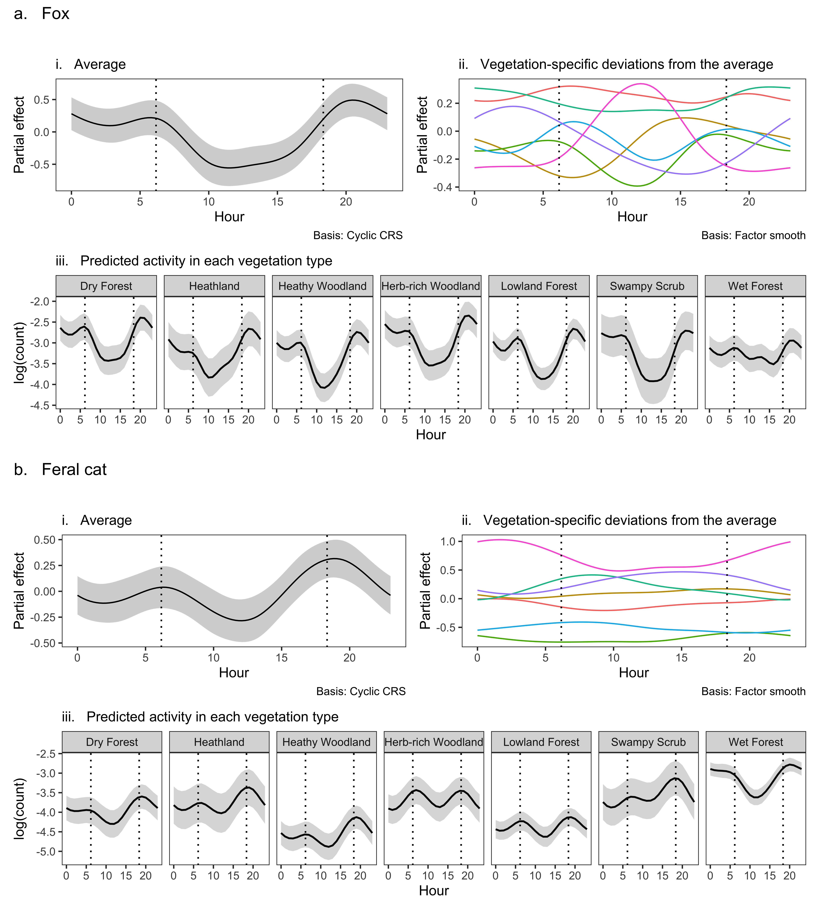

\parskip=12pt 


\newpage


```{r setup, include = FALSE}

knitr::opts_chunk$set(echo = FALSE, cache = FALSE, warning = FALSE, message = FALSE)

```

INTRODUCTION
==========================

Diel activity patterns - the distribution of activity throughout the daily cycle - are an important but overlooked aspect of behavioural ecology. Animals must allocate particular times of the day to rest, forage, socialise and reproduce, which are traded-off against threat avoidance (e.g. predation) and deterrence against resource loss (i.e. inter and intraspecific competition). Diel activity can therefore vary spatially across different environmental conditions (e.g. food, shelter availability) and species assemblages. This is important to understand because constrained diel behaviour can incur fitness costs to individuals and populations (Lamb 2020 PNAS).

Flexible spatiotemporal behaviour can allow animals to adapt to changing conditions. For example, elk in Yellowstone National Park use risky, open parts of the landscape when the activity of reintroduced wolves is low, suggesting coexistence without major fitness costs (Kohl et al. 2019). Diel activity decisions are clearly linked to habitat type, and there is growing recognition of individual-level variation in these decisions (Basille et al 2015; time-limited seabirds; urban bears). This is important to consider because populations with high individual heterogeneity are likely more adaptable to threats (Wolf and Weissing 2012; Dingemanse and Wolf 2013). Most studies examine spatiotemporal behavioural responses by repeating spatial analyses at different time periods (generally night and day), but few consider continuous shifts in diel activity across spatial contexts. 

Diel activity patterns are increasingly being considered as technology like telemetry devices and camera-traps have become more widely available. Telemetry devices like GPS collars and accelerometers provide high resolution data at the individual-level. However, resource constraints generally limit these studies to few individuals (Harmsen 2009), and target similar personalities which are susceptible to physical capture. Camera-traps are particularly useful because they concurrently survey multiple species--including the elusive individuals--providing inference on ecological differences and species interactions. However, individual-level inference would be limited to species with unique markings. Distiller et al 2020 recently used camera-traps to individually identify jaguars and estimate sex difference in diel activity patters. Despite having information on individual diel activity patterns, studies predominantly estimate at the population-level due to small sample sizes.

A variety of statistical approaches are used to examine how diel activity patterns vary among habitat types, individuals and co-occurring species. Kernel density estimation is most often used to estimate hourly activity curves (Linkie & Ridout, 2011), however this methods is susceptible to noise from sample sizes (Iannaerlli) and does allow interactions with covariates (Frey 2017). They remain popular because largely because they estimate a coefficient of overlap between two diel activity curves - either between two species, or one species in two different contexts. However, rarely are there only two interacting species or categorical contexts. Joint approaches with spatial overlap coefficients are being developed (e.g. Azzou et al 2021; Farris et al 2020) to account for the spatiotemporal nature of species avoidance strategies. However, activity overlap coefficients may just reflect different niche preferences. A threat response may not be routine, but only employed or enhanced when the threat is heightened. And so, whether an animal *changes* its activity patterns with an increasing threat level (e.g. higher apex predator activity) is more interesting and relevant to management than arbitrary overlap. 

Straightforward, integrated methods for examining changes in spatiotemporal animal behaviour are needed. Generalised additive models (hereafter 'GAMs') are increasingly used to estimate diel activity patterns (e.g xx). GAMs learn from data to specify nonlinear relationships between response and explanatory variables. Unlike kernel density estimation (Linke and Ridout), GAMs include smoothing penalties to avoid overfitting (making them less susceptible to noisy estimates due to small sample sizes) and allow diel activity to vary with explanatory variables. GAMs are also being used to test spatial associations between species (e.g. my chapter 2) as a dominant species may only suppress subordinate species at high densities (Johnson). Despite this potential, diel activity curves are rarely modelled with categorical or continuous covariates, particularly using another species as that covariate (although see Cunningham). Further, GAMs can share information across conditions using heirarchical smooths, which estimate an average response, as well as group-level estimates [@pedersen2019hierarchical]. Group-level estimates are more penalised as they deviate from the average, allowing confidence that these are true deviations across groups (e.g individuals, categorical environmental conditions).  

Here we provide a case-study to illustrate how generalised additive models can be used to assess spatiotemporal behaviour of two predator species. The Red fox *Vulpes vulpes* (hereafter 'fox') and feral cats *Felis catus* (hereafter 'cat') have some of the widest distributions of any carnivores, and co-occur across most of their global range. Because of their devastating impacts on native prey in their introduced range, understanding differences in their behavioural ecology across space, and how foxes may impact feral cat behaviour is key to effective management. Numerous studies have tested spatial and temporal associations between these invasive predators and environmental covariates, but not in a spatially explicit or joint modelling framework. We therefore investigated how invasive predator activity varies across (1) space and (2) vegetation types, as well as how feral cat activity varies across fox activity levels (3) and individuals in two distinct study regions. We tested this in a simple predator system where only cats and foxes occur, and fox activity is manipulated through lethal control. This allowed focus on the sole interactions between these two predators, and ensuring correlations doesn't simply reflect different niche preferences. 


\newpage

MATERIALS AND METHODS
==========================

## Study area
We collated camera-trap data on these two predator species from three distinct studies across two regions of south-west Victoria, Australia (Fig. \@ref(fig:diel-map)). The terrestrial mammalian predator guild is depauperate throughout both regions. Dingoes *Canis familiaris* are now absent throughout, as is the tiger quoll *Dasyurus maculatus*, more recently absent in the Otway Ranges (last sighted in 2014 despite extensive camera-trapping). Introduced foxes and cats are therefore the only medium-large functional mammalian terrestrial predators across both regions. 

The purpose of each collated study was to experimentally survey changes in the mammalian community due to fox control. In broad sections of each region, government land managers conduct ongoing targeted fox control for biodiversity conservation. Poison baits containing 3 mg of sodium mono-fluroacetate (1080) are buried at a depth of 10 cm at 1-km intervals along accessible forest tracks and roads. This allowed us to investigate fox-cat interactions across a gradient of apex predator (fox) activity and other landscape contexts. 

In the Glenelg region, Gunditjmara country, natural vegetation is highly fragmented. Here, camera-survey sites were situated in six distinct forest blocks: two are separated by a river, the others are separated by at least **XX** km of pastoral farming and residential property (Fig. \@ref(fig:map)). Foxes in three of the forest blocks have been subject to lethal control since October 2005, with 1080 poison-baits replaced fortnightly [@ROBLEY2014262]. The Otway Ranges, Gadubanud country, is a largely continuous patch of natural vegetation with a strong east-west rainfall and elevation gradient [@swan2021species]. Foxes are controlled through 1080 poison-baits with monthly replacement across most of the Otway Ranges, but a large section to the north-west remains unbaited. The majority of this baiting began in 2016 - 2017, although fox-baiting commenced in some small sections in 2008. Alongside fragmentation, the extremely rugged, wet forest and rainforest matrix in the western Otway Ranges is the main difference between the two regions. Prescribed fire is another key management action undertaken throughout both regions (except in very wet sections of Otway Ranges), primarily for asset protection.
 
## Camera-trap surveys
We compiled camera-trap data from three distinct studies across the two regions. After removing camera-traps which were operational for less than 14 days, this totalled 3694 deployments of camera-traps at 1232 camera-trap sites. Camera-traps were active for an average of 47 days, totalling 172,167 trapnights. Camera-trap spacing was variable; the average minimum distance between simultaneously deployed camera-traps was 445, 853 and 1266 metres for each study. Camera-traps were deployed in the Glenelg region between 2013 – 2019, and in the Otway Ranges between 2016 – 2019. 

All camera-trap deployments consisted of a Reconyx (Holmen, Wisconsin) brand camera-trap (both white and infrared flashes), attached to a tree or a metal picket, facing a lure. Camera-traps were set-up in two ways depending on the key aim of the project, either targeted toward predators or prey species. One study across both regions positioned camera-traps lower on a tree (around 15 - 30 cm above the ground – angled only slightly downwards) facing a tuna oil lure approximately 2 - 2.5 m away [detailed in @REES2019108287]. The remaining camera-traps were positioned higher on a tree or a metal picket (at least 40 cm above ground) and angled downwards more strongly - facing a lure approximately 1 - 1.5 m away. These lures consisted of peanut butter, golden syrup and rolled oats mixed into a small ball, placed within a tea strainer or PVC pipe container and secured either to the ground, or 20 - 60 cm above ground on a wooden stake. All set-ups were effective in detecting both predator species.  

## Data preparation
We first created a table of species detections and deployment information (coordinates, dates) for every camera-trap deployment.  All data analysis was conducted in R version 3.6.3 [@R]. We used lorelograms to identify the minimum interval to approximate independence [@https://doi.org/10.1111/2041-210X.13308]; this indicated 30 minutes discarding repeat detections of a species within 30 minutes was sufficient in reducing temporal autocorrelation. To account for day length variation across space and time, we extracted sunrise and sunset times for each camera-trap deployment using the 'maptools' R-package [@maptools] and adjusted detection times to be relative to sunrise and sunset using the average double anchoring approach described by @https://doi.org/10.1111/2041-210X.13290. Using the 'reshape' R-package [@reshape], we manipulated the detection table into a dataframe with a row for each hour of the day, for every camera-trap deployment, recording the total number of 'independent' fox and feral cat detections within each hour for the entire camera-trap survey duration.  

We attached the Ecological Vegetation Class (hereafter 'EVC') group [@delwp2020]) at each camera-trap location. **Six?** vegetation types were surveyed in both regions, although to varying degrees (Table 1). In the Otway region, rainforests are interspersed (primarily in low lying gullies) throughout wet and damp forests at a finescale, and we merged these groups (hereafter 'wet forests'). For each deployment, we calculated the number of poison fox-baits within a 2.3 km radius around each camera-trap - the average maximum distance foxes in these regions travel from their home range centre [@hradsky2017human]. To investigate changes in feral cat diel activity in response to counts of foxes. We added an extra column to our dataframe with the number of fox detections divided by the log of the number of survey days to account for differences in camera-trap survey durations (hereafter 'adjusted fox counts'). 


## Generalised additive models
We modelled the total predator counts for each camera-trap deployment (response variable) with generalised additive mixed-effect models implemented in the 'mgcv' R-package [@wood2017]. GAMs learn from the data to specify nonlinear relationships between response and explanatory variables. A maximum wiggliness is specified for each explanatory variable, with complexity automatically reduced (ultimately to a linear function) through a smoothing penalty to avoid overfitting. We used REML estimation and the negative binomial family (as overdispersion, but not zero-inflation, was detected using the 'DHARMa' R-package [@DHARMa]). We specified a model offset to account for differences in camera-trap survey duration, and a random intercept for each site to account for repeat sampling. For fox models (n = 2), we included a smooth effect of poison-bait density using a thin plate regression spline basis. This formed the base model specification for each model we fitted. Models differed in their specification of the cyclical hour smooth in order to provide inference on variations of predator diel activity across (1) space (i.e. coordinates) (2) EVC groups, as across for feral cats across the range of observed fox counts (3), and across each identified individual cat (4), detailed in the sections below. This model specification allowed both spatial activity to be higher in each context (i.e. across coordinates, vegetation types, fox activity levels, individual cats) in addition to variable diel activity patterns. Code used to specify each model set is presented in the Supporting Information. We plotted models using 'ggplot2' and 'gratia' R-packages [@ggplot2; @gratia].

### Spatial variation in predator activity
We fit a model separately for both foxes and cats which included a tensor product interaction between a spatial smooth and hourly smooth. This allowed predators to have different activity levels across space (static across the years surveyed), as well as a variation in diel activity across space. Space was modelled using camera-trap coordinates and a duchon spline basis (Miller and Wood). To compare relative diel activity pattern strengths--how much activity patterns vary across the daily cycle--we plotted the difference between the minimum and maximum activity estimate for every predicted location. 

### Variation in predator activity across vegetation types
We estimated diel activity across EVC group using a hierarchical model specification. This included a global smoother for hour (i.e. average response), along with group-level smoothers for each EVC group with shared shared wiggliness [i.e. model GS in @pedersen2019hierarchical]. This model structure penalises functions which deviate strongly from the average response. 

### Feral cat spatiotemporal avoidance of foxes
Analysis of fox diel activity across EVC groups (section 4.2.2) showed strong similarity between all vegetation groups except wet forests. We therefore hypothesised that cats would temporally avoid foxes by becoming more diurnal in dry vegetation groups, but not in wet forests. We therefore modelled fox-induced changes in feral cat diel activity separately for wet and dry vegetation groups. We further split dry vegetation groups by region for replication. We refer to the resulting variable as 'habitat type', which had three levels: (1) wet forests and rainforests in the western Otway Ranges ('wet_otways'), (2) dry EVC groups of the Otway Ranges ('dry_otways') and the Glenelg region ('dry_glenelg'). 

We used a tensor product of hour (using a cyclic cubic regression spline) and log adjusted fox count (using a thin plate regression spline) smooths to model feral cat diel activity across the range of observed fox activity. We specified this with a by variable factor smooth to model separate responses for each habitat type. We turned on the double penalty model selection, which penalises the null space in addition to the range space (i.e. shrinking wiggly terms to linear functions) of the spline basis, meaning covariate effects can be entirely removed from the model [@MARRA20112372]. This meant that feral cat activity could vary nonlinearly and be penalised consistently across both dimensions. This model specification allows five different scenarios: that there was (1) no effect of hour or foxes on feral cats (2) a static hourly effect only, (3) a spatial response to foxes only, (4) a spatial response to foxes and an unrelated static hourly effect, (5) a spatial response to foxes and a hourly effect which changes across the range of fox counts. Additionally, we included a separate smooth for space (using a duchon spline) to account for the effect of unmodelled environmental covariates and spatial autocorrelation -- increasing confidence that only cat responses to foxes were being estimated. 

### Individual variation in feral cat diel activity
One of the collated datasets identified identified individual cats based on unique pelage patterns across the wet forests of the western Otway four forest blocks in the glenelg region (matt chapter 2). We used only this dataset to estimated individual heterogeneity in cat diel activity using a hierarchical model specification. This included a global smoother for hour (i.e. average response), along with group-level smoothers for identified cat with a common wiggliness [i.e. model GS in @pedersen2019hierarchical]. This model structure penalises functions which deviate strongly from the average response, so individual with few detections will take the shape of the global response. 


\newpage

```{r diel-map, fig.cap = "Locations of our study regions in south-west Victoria, Australia. The grids of camera-traps are denoted by white dots. The Glenelg region is to the west and Otway region to the east. Native vegetation is indicated by dark green, with hill shading. \\textit{Map tiles by Stamen Design, under CC BY 3.0, map data by OpenStreetMap, under CC BY SA.}"}
knitr::include_graphics("../figs/fig1_map.png")
```

\newpage

RESULTS
============

## Spatial variation in predator activity

Increasing difference between the minimum and maximum activity estimate over the 24-hour cycle for each location. Red foxes concentrate their activity during particular times of the day–especially in the Glenelg region (a)–whereas feral cats have a relatively consistent activity throughout the daily cycle. Both predators exhibited similar spatial patterns in diel activity strength across the Glenelg region, but seemingly opposing patterns in the Otway Ranges.


## Variation in predator activity across vegetation types
On average, both predator species occupied similar times of the day--mostly nocturnal with activity peaks around sunrise and sunset. The main difference was that fox activity peaked just after sunset rather than on sunset. For foxes, this diel pattern was largely exhibited across all vegetation types except wet forest. In wet forests and rainforests, the hour of the day had little effect on foxes (especially considering diel activity curve here is being drawn towards a nocturnal pattern). 

lowest activity during the middle of the day, peaking at sunrise and sunset times, while remaining relatively high at night and dawn. 
Foxes had a stronger diel activity patterns than cats, much less likely to be out during the day. 

Diel activity patterns were similar across the different vegetation types for each predator,, except for wet forests, where more substantial changes were seen. In the wet forests, ox activity remained fairly constant throughout day and night barely had any diel activity pattern here, cats more nocturnal.

Both invasive predator have an average (i) crepuscular - nocturnal diel activity pattern, with slight deviations across the dry EVC groups and larger deviations in wet forests. Unlike feral cats, fox spatial activity was relatively consistent across EVC groups.14


## Feral cat spatiotemporal avoidance of foxes
We saw evidence of changes in cat diel activity due to fox activity in all three habitat types. Similar responses in dry habitats of both regions -- cat spatial activity increased with fox spatial activity, but became more diurnal. 
In Otway wet forests, no real change in spatial activity of cats due to foxes, but cats became more strongly nocturnal.  
Deviance explained and Rsq value was XX.
Slightly higher uncertainty where fox spatial activity is high, this is because we had a largest sample size for fox absences, and fewest at the extreme of fox activity. 

In the Glenelg region, there were more feral cat detections wherethere were more fox detections, but diel activity shifted from night to day (a). In the Otway Ranges, feral cats shifted todiurnal activity where fox actity was high in dry vegetation types (b), but became more nocturnal where fox actity washigh in the rainforests and wet forests (c).

## Individual variation in feral cat diel activity

Individual heterogeneity in feral catFelis catusdiel activity across the Glenelg region (39 identified indiviuals; a)and wet forests of the western Otway Ranges (94 identified indiviuals; b) in south-west Victoria, Australia. As an example,the predicted activity of the seven individuals with the most detections (iii). Dotted, vertical lines represent average sunriseand sunset times. Shaded areas indicate 95% confidence intervals. The global function of feral cat diel activity in theGlenelg region was shrunk to an almost flat line, signalling high individual variation (deviations can therefore be intepreteddirectly as unique diel patterns). In the Otway wet forests, feral cats were on average nocturnal, individuals mostly deviatedwith different activity peaks near sunrise and sunset times.


\newpage

```{r tab1}
library(pander)
library(tidyverse)

# load records
records <- read_csv("../derived_data/counts_hour_cleaned.csv")
# drop hour
records <- distinct(records, station_year, .keep_all = TRUE)
# get unique sites dataframe
camdata <- distinct(records, station, .keep_all = TRUE)

table1 <- records %>%
  group_by(region, vegetation_group) %>%
  mutate(sites = length(unique(station)),
         deployments = length(unique(station_year)),
         fox_count_vr = sum(fox_count),
         cat_count_vr = sum(cat_count),
         fox_present = sum(fox_pa == "present"),
         cat_present = sum(cat_pa == "present")
         )

table1 <- table1 %>%
  select(vegetation_group, region, sites, deployments, fox_count_vr, cat_count_vr)  %>% 
  distinct() %>%
  arrange(vegetation_group, region)

# rename region 
table1$region <- factor(table1$region)
levels(table1$region) <- c("Glenelg", "Otway")

# make table
pander(table1, style = "simple", split.table = Inf, caption = "Summary of the number of camera-trap deployments, unique survey sites and 'independent' counts of invasive predator detections across Ecological Vegetation Class groups within the Glenelg and Otway regions, south-west Victoria, Australia.", round = 2,
              col.names = c("Vegetation", "Region", "Sites", "Deployments",  "Fox counts", "Cat counts"),
)

```

\newpage

```{r space, out.width="100%", fig.cap = "Relative spatial patterns of invasive predator diel activity strength across the two study regions in south-west Victoria, Australia. White crosses depict unique camera-trap sites; colour brightness scales with increasing difference between the minimum and maximum activity estimate over the 24-hour cycle for each location. Red foxes \\textit{Vulpes vulpes} concentrate their activity during particular times of the day--especially in the Glenelg region (a)--whereas feral cats \\textit{Felis catus} have a relatively consistent activity throughout the daily cycle. Both predators exhibited similar spatial patterns in diel activity strength across the Glenelg region, but seemingly opposing patterns in the Otway Ranges."}
knitr::include_graphics("../figs/diel_strength_600dpi.png")

```

\newpage

```{r veg, out.width="100%", fig.cap = "Red foxes \\textit{Vulpes vulpes} (a) and feral cat \\textit{Felis catus} (B) activity patterns across Ecological Vegetation Class (EVC) groups in south-west Victoria, Australia. Dotted, vertical lines represent average sunrise and sunset times. Shaded areas indicate 95\\% confidence intervals. Both invasive predator have an average (i) crepuscular - nocturnal diel activity pattern, with slight deviations across the dry EVC groups and larger deviations in wet forests. Unlike feral cats, fox spatial activity was relatively consistent across EVC groups."}

```


\newpage

```{r count, out.width="100%", fig.cap="Variation in feral cat \\textit{Felis catus} activity (a) and uncertainty (b) in response to 'independent' red fox \\textit{Vulpes vulpes} detections (log-transformed and survey effort adjusted) across each 'habitat type' in south-west Victoria, Australia. Grey vertical lines respresent average sunrise and sunset times. In the Glenelg region, there were more feral cat detections where there were more fox detections, but diel activity shifted from night to day (a). In the Otway Ranges, feral cats shifted to diurnal activity where fox actity was high in dry vegetation types (b), but became more nocturnal where fox actity was high in the rainforests and wet forests (c)."}
knitr::include_graphics("../figs/cat_fox_count.png")
```

\newpage

```{r ind, out.width="100%", fig.cap = "Individual heterogeneity in feral cat \\textit{Felis catus} diel activity across the Glenelg region (39 identified indiviuals; a) and wet forests of the western Otway Ranges (94 identified indiviuals; b) in south-west Victoria, Australia. As an example, the predicted activity of the seven individuals with the most detections (iii). Dotted, vertical lines represent average sunrise and sunset times. Shaded areas indicate 95\\% confidence intervals. The global function of feral cat diel activity in the Glenelg region was shrunk to an almost flat line, signalling high individual variation (deviations can therefore be intepreted directly as unique diel patterns). In the Otway wet forests, feral cats were on average nocturnal, individuals mostly deviated with different activity peaks near sunrise and sunset times."}
knitr::include_graphics("../figs/cat_ind.png")
```

\newpage


DISCUSSION
===================

Foxes likely impacted the spatiotemporal behaviour of feral cats. One of the few studies to actually demonstrate and replicate this across ecosystems. 
Happens in different ways - context key. Spatial only, as well as temporal only models would have had opposite inference - high overlap. Joint spatiotemporal analysis is key to understand predator interactions.  

Our approach is simple and flexible. 
Small sample sizes are usually a problem. We demonstrate hierarchical model specification to share information - ability to pool all available data. 
Our approach is more aligned with null hypothesis testing - small sample sizes shrink to a flat line (or to the average), in contrast to circular overlap. 
Could be easily adapted to other contexts. E.g. instead of vegetation type, could do individual variation in diel activity.  

Combined spatiotemporal modelling - differences to other approaches. 
Cunningham paper most similar to our approach - different in diel activity only, and linear responses.
We used a tensor product for fox counts because predator interactions may not be linear [@https://doi.org/10.1111/j.1365-2664.2009.01650.x].

Limitations of our approach. 
Detectability ignored. 
Individual heterogeneity ignored.
Correlation does not = causation. 
Does not (clearly) seperate numerical responses from behavioural (Borchers SCR paper)

Invasive predators are useful species to test this on, as they are extremely adaptable to different conditions.
Implications for prey. 

Conclusions. 


\newpage

ACKNOWLEDGEMENTS
===================
We acknowledge and pay respect to the Gadubanud and Gunditjmara people on whose traditional lands this study took place. This experiment was a collaborative effort between the Glenelg Ark (Department of Environment, Land Water and Planning) and Otway Ark (Parks Victoria) working groups. We are extremely thankful to those who led and assisted with these camera-trap deployments and image processing. University of Melbourne led surveys were conducted under University of Melbourne Animal Ethics Committee approval 1714119 and Victorian Government Department of Environment, Land Water and Planning Research Permit 10008273. Our study was generously supported by the Conservation Ecology Centre, the Victorian Government Department of Environment, Land Water and Planning, Arthur Rylah Institute for Environmental Research, Parks Victoria and the Australian Government’s National Environmental Science Program through the Threatened Species Recovery Hub, and ARC Linkage Project LP170101134. MR also receives support from an Australian Government Research Training Program Scholarship.


OPEN RESEARCH
===================

Raw data and code are on Github link xx.  
Data will be deposited on the Dryad Digital Repository after acceptance.

\newpage

REFERENCES {#references .unnumbered}
==========

GRAVEYARD
===================

Diel activity patterns are a product of physiological constraints, species adaptiveness and landscape context. These dynamics depend on both environmental conditions and those of other species, but few statistical approaches incorporate both factors, or allow responses to be dynamic across space and time. This is key because species interactions and niche preferences are multidimensional.

Animal diel patterns may not only vary across different spatial contexts, but so too may threat responses.

Animals may be naive to threats (e.g. alien predators), unable to respond to threats (e.g. scarce prey), or the threat may be too minimal to warrant a response. Some environments more easily facilitate avoidance (e.g. high food and shelter accessibility), and so accounting for landscape context is key.

It is critical to replicate studies across different ecosystem contexts to understand how generalisable behavioural changes are, but this is seldom done. Invasive species, which are widespread and highly adaptable to new conditions, are perfect subjects to test generalisability in spatiotemporal responses. That and there are clear management incentives.


We expected the activity of each predator species to follow a broadly consistent pattern (e.g. lower during the day), but potentially have small shifts in relative activity between sunset and sunrise across the different EVC groups (1). Fitting separate responses for each EVC group would throw away shared information, which is particularly costly for the least surveyed groups, and would result in more noisy estimates.